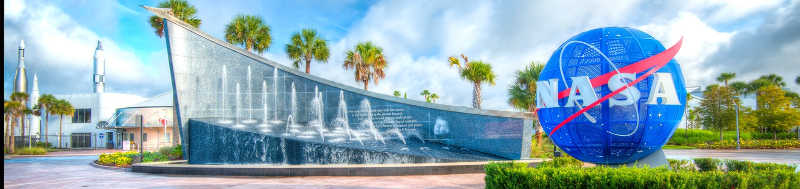
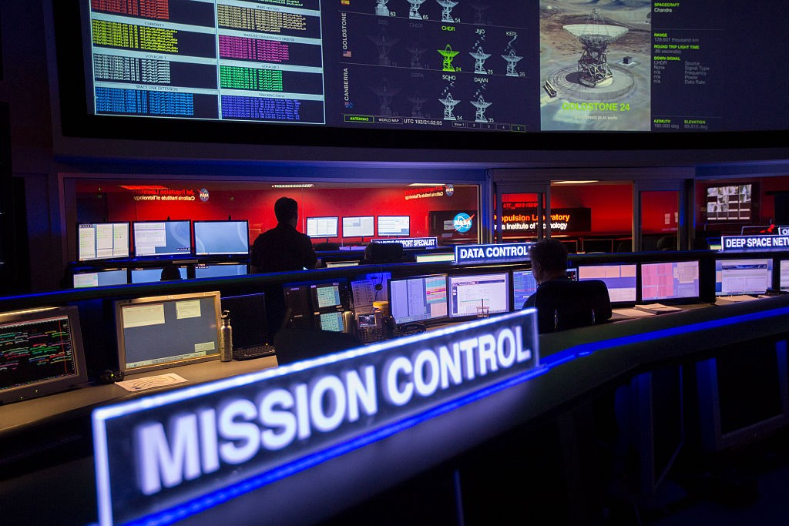
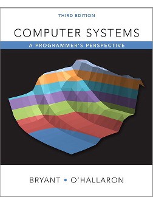
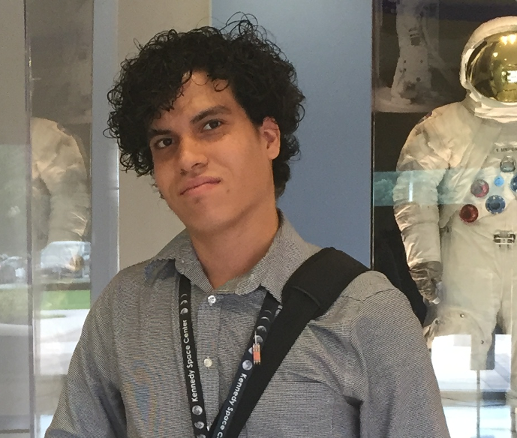

原文链接：[A Look Into NASA’s Coding Philosophy](https://mystudentvoices.com/a-look-into-nasas-coding-philosophy-b747957c7f8a)  
基于译文稿：[看NASA的编码哲学](http://www.10tiao.com/html/262/201708/2651375489/1.html)

# 看`NASA`的编码哲学

肯尼迪航天中心

为肯尼迪工作过并不意味着我为`NASA`代言。这个写作是以个人身份进行的，来自于我在`Twitch`上的现场演讲。

-----------------------------

<!-- START doctoc generated TOC please keep comment here to allow auto update -->
<!-- DON'T EDIT THIS SECTION, INSTEAD RE-RUN doctoc TO UPDATE -->

- [谁在我们中说出真相？](#%E8%B0%81%E5%9C%A8%E6%88%91%E4%BB%AC%E4%B8%AD%E8%AF%B4%E5%87%BA%E7%9C%9F%E7%9B%B8)
    - [现代软件世界](#%E7%8E%B0%E4%BB%A3%E8%BD%AF%E4%BB%B6%E4%B8%96%E7%95%8C)
- [`NASA`的四个假设](#nasa%E7%9A%84%E5%9B%9B%E4%B8%AA%E5%81%87%E8%AE%BE)
    - [你可以问导师](#%E4%BD%A0%E5%8F%AF%E4%BB%A5%E9%97%AE%E5%AF%BC%E5%B8%88)
    - [我们相信彼此的潜力](#%E6%88%91%E4%BB%AC%E7%9B%B8%E4%BF%A1%E5%BD%BC%E6%AD%A4%E7%9A%84%E6%BD%9C%E5%8A%9B)
    - [你会说『我不明白』](#%E4%BD%A0%E4%BC%9A%E8%AF%B4%E3%80%8E%E6%88%91%E4%B8%8D%E6%98%8E%E7%99%BD%E3%80%8F)
    - [我们深入了解计算机系统如何运作](#%E6%88%91%E4%BB%AC%E6%B7%B1%E5%85%A5%E4%BA%86%E8%A7%A3%E8%AE%A1%E7%AE%97%E6%9C%BA%E7%B3%BB%E7%BB%9F%E5%A6%82%E4%BD%95%E8%BF%90%E4%BD%9C)
- [避免不可靠的知识来源](#%E9%81%BF%E5%85%8D%E4%B8%8D%E5%8F%AF%E9%9D%A0%E7%9A%84%E7%9F%A5%E8%AF%86%E6%9D%A5%E6%BA%90)
    - [信仰](#%E4%BF%A1%E4%BB%B0)
    - [启发](#%E5%90%AF%E5%8F%91)
    - [魅力](#%E9%AD%85%E5%8A%9B)
    - [光辉](#%E5%85%89%E8%BE%89)
- [扩展你的计算机素养](#%E6%89%A9%E5%B1%95%E4%BD%A0%E7%9A%84%E8%AE%A1%E7%AE%97%E6%9C%BA%E7%B4%A0%E5%85%BB)
- [建议](#%E5%BB%BA%E8%AE%AE)
    - [计算机系统：程序员的视角](#%E8%AE%A1%E7%AE%97%E6%9C%BA%E7%B3%BB%E7%BB%9F%E7%A8%8B%E5%BA%8F%E5%91%98%E7%9A%84%E8%A7%86%E8%A7%92)
    - [寻找志同道合的人](#%E5%AF%BB%E6%89%BE%E5%BF%97%E5%90%8C%E9%81%93%E5%90%88%E7%9A%84%E4%BA%BA)
- [关于作者](#%E5%85%B3%E4%BA%8E%E4%BD%9C%E8%80%85)

<!-- END doctoc generated TOC please keep comment here to allow auto update -->

-----------------------------

## 谁在我们中说出真相？

### 现代软件世界

在编程社区中有一个反复出现的话题，与寻找『更好的方式』来编写『现代软件』有关。无论术语『现代』是否真的有用 —— 计算机编程存在的时间本来就不长，人们却总是对这个话题说『新』或者『更好』，这着实令我印象深刻。并且如果我们关注当今软件开发领域的话题，我们会很快意识到明辨是非的重要性：一定要区分清楚什么是有用的，什么不是。

**NASA必须砍掉废话**

编写与安全相关的软件时，赌注很高（图片来自David McNew/Getty Images）

鉴于所有关于现代软件的评论，我看到初学者程序员问我他们职业生涯中最重要的问题：『我们应该注意哪些事情？』，而且老实说，如果接下来我就给他们讲解下面这些问题那就太说不过去了：

- `OOP`是编程的未来吗？
- 快点加入`Rust`、`Evangelism`、`Strikeforce`、`LUL`
- `Go`语言是否完全比『为其他目标设计的语言』更好？

至少，如果让`NASA`回答，`NASA`肯定不会这样回答。众所周知的，`NASA`中如果其软件中的任何一个软件不正确，那么空间程序可能会遭受不可逆转的后果，其中包括死亡。这种现实的震撼使他们能够更严谨的编程，因此看看他们的价值观可能是有启发性的。

在那里工作多年，我希望提供一个关于航天局生产世界上最可靠的软件的哲学的第一手资料，我将用一套四个假设来描述他们对编程的态度。

## `NASA`的四个假设

### 你可以问导师

『谁是你的导师？』在`NASA`如果两个腼腆的程序员不知道如何开始对话，那么这个问题往往可以很好地打破尴尬。这是由于该机构的承诺，确保每个程序员都有一个导师。导师可能在业务层面，`OSBP`的`Mentor-Protégé`程序，内部`NEXT`项目，或与路径机构跨中心连接（`PAXC`）方面进行指导。更赞的是，你不需要想尽办法去找一个导师，因为我们从一开始就都被每人分配了一个导师。程序员缺乏经验的想法对于太空计划来说是可怕的。

### 我们相信彼此的潜力

由于进入机构之前每个人都接受过联邦的背景调查，所以我们有理由相信彼此。同时，我们也有理由认为每个人都是有才能的，我们相信个人的潜力是不可忽视的，实习生对高级的`NASA`软件项目做出贡献并不罕见。

### 你会说『我不明白』

这句话在机构中随处可见，你会见到知识渊博的高级开发人员问实习生『我不明白这部分代码库。这是一个我不了解的语言功能吗？『或管理层问工程师』我不知道你今天工作的影响是什么。我们可以再多看几遍，直到我把握了，好吗？『这些问题是日常工作的核心。

### 我们深入了解计算机系统如何运作

`NASA`深度地需要研究关于计算机如何工作的知识，他们发现了发现基本系统限制的价值，以防止支持坏的软件开发决策。

想想 _Gene Amdahl_，他是一个早期的计算机先驱，他做过一个有趣的调查：改进系统的一个组件会带来多大的效用？就是说你的程序运行时间的百分之五十提高了四倍，现在我们想知道整个应用程序的速度提高情况。换句话说，某个程序需要时间T1运行到完成，现在其中的一部分（从`T1`中获取一个分数`f`）改进为了原先的`k`倍快。尽管很简单，我还是会用数学的方式分析它，使用`T1`、`f`、`k`定义新的时间`T2`，并且以`T1`和`T2`的比率表示相对的性能提升。你会得到以下公式：

套入`Amdahl`的公式，与前面的例子一起，要知道你的应用程序只需应用公式：

最终得出 1.6，虽然你将整个程序的一半速度提高了四倍，但整个系统的速度只提高了 1.6倍。让我们进一步来看下，假设你又采取了一切其他的优化手段，运行它所需的时间现在为零（`k`趋于无穷大）。你得到一个特殊情况即`Amdahl`定律：

假设组件占程序运行时间的 60%，现在无需运行它，理论上的最大加速是 2.5 ... `Amdahl`定律告诉我们，为了显着提高系统的速度，我们必须提高其很大一部分的性能。这个定律经常用于并行计算，以预测使用多核处理器的加速，而 _Julian Browne_ 在这种情况下对其进行了重新设计：『本质上，虽然过程可以分解成并行运行的步骤，但整个过程将受到保持序列化部分的严重限制。

在脑子中记住这些假设，本文的其余部分将谈谈一些更加个人化的观点：从这些假设中我们可以学到什么？

## 避免不可靠的知识来源

我的一些朋友认为编程行业还没有成熟，因为它处于一个前科学的阶段。我声称我们许多人潜意识地认同已经被证明是不可靠的传统知识来源，据我所知，美国航空航天局已经做好了对下面这些知识来源的防范：

### 信仰

我不是指那种类似希望那样的信仰。当我们想相信一些没有理由相信的东西时，也会使用信仰：

- 领导：我喜欢我们应用程序中为客户写的新功能，你说你下载了一个库来写？
- 小辈：是啊 到目前为止，它工作正常。
- 领导：是开源吗？否则谁是供应商，他们在支持上有多好？你有没有证明它是稳健的，并在我们的参数空间进行测试？
- 小辈：不，我已经用它一段时间，没有造成任何问题。
- 领导：*PLONK*

这不仅发生在随机下载软件的情况中，还有的时候你的代码一直调试不好，但是某个语句神奇地解决了问题，虽然你不知道为什么，但是接下来一天你就在各个位置到处使用这个语句。事实上很难发现一个人多大程度上是依据信仰判断一个软件好坏的，但是如果任由这种信仰支撑的代码存在足够长的时间的话，将会导致软件到处都是奇怪的错误。

### 启发

有些事情你觉得是正确的，甚至觉得是对自己的启发，仅仅是因为一个牛逼的人说过它是正确的，或者以前人们一直觉得它是正确的。你相信它，并不是你自己思考的结果。仔细想想那些社区的热门讨论，比如什么编辑器是至高无上的，或者使用哪一门语言使你成为更优秀的程序员之类，这些问题本质上不过是程序员门在为自己在编程社区的某个子集中找到认同罢了。

### 魅力

会议充满了欣欣向荣的气氛；为下一个框架的到来而兴奋。一个充满激情的作家以歌唱的声音来到舞台上，会议和幻灯片讨论了承诺防弹编程实践的最新原则 —— 将使您成为10x程序员（就是现在！）。在热情的人群中，以及作者谈话的官方环境中，很难认识到作者的说法是否是真的，当然最重要的是买书。

### 光辉

我意识到这是一个奇怪的词语，但是当一个想法令人信服和令人兴奋的时候，它似乎会发出一定的『光辉』。它是有光泽的，因此必须是真实的。

我们可以继续下去，但是从上面这些情绪中脱离出来，是对我们的技术进步有科学意义的。

## 扩展你的计算机素养

当谈到科学素养时，关于宇宙本质的谈话通常更有用。同样，当每个人在计算机素养方面达到一定的门槛后，关于编程的讨论才能带来更多益处。的确，有一些持久的想法给计算机系统带来生命，程序员应该重视它们。如果我们称自己是专业人士，我们有责任了解计算机背后的基本概念。它可以避免不可靠的知识来源，并向我们展示我们应该注意的事情。美国宇航局意识到这一点，并且确保了组织的文化能够让每个人的读写能力得到飞涨。

## 建议

以上的内容是否有共鸣？您是否希望提高计算机素养？如果是，我有几个个人建议。

### 计算机系统：程序员的视角

人称 CS:APP

《计算机系统：程序员的观点》在我的职业生涯中非常重要，是我最喜欢的编程书。这里涵盖的主题是我认为每个人都应该拥有的基础。至少，对1-3章，内存层次和系统`I/O`的深入研究是有益的。如果你正在开展任何与网络有关的任务，那么网络编程一章是值得注意的。

### 寻找志同道合的人

有一个叫做`Handmake Network`的小社区，一个令人难以置信的团队（我是团队的一部分），因为我们试图建立一个我们可以摆脱现代软件对话的地方，而是谈论我所铺的东西。我们与其他社区一样脆弱，但我们试图认识到这一点。
社区还与知名程序员讨论事态的状况，不管他们是否同意我们的结论。

## 关于作者

2017年在肯尼迪航天中心工作三年，编写和维护发射控制系统软件。我在2015年之前被授予了肯尼迪的年度实习生，导致我到美国航空航天局的『Pathways』计划，在那里我负责研究如何简化飞行空间机器人的调试（等待）。这项工作的成果让我登上了肯尼迪2016年『十佳创新者』榜单 —— 尽管只是勉强！

我的大部分工作是`SBU`，所以它可能不会在线披露，但是在技术上却是可以的。你可以通过Twitter，Twitch或者电子邮件找到我。
