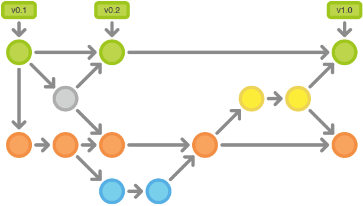

`Gitflow`工作流
============================

- [工作方式](#beer-工作方式)
    - [历史分支](#历史分支)
    - [功能分支](#功能分支)
    - [发布分支](#发布分支)
    - [维护分支](#维护分支)
- [示例](#beer-示例)
    1. [创建开发分支](#创建开发分支)
    1. [小红和小明开始开发新功能](#小红和小明开始开发新功能)
    1. [小红完成功能开发](#小红完成功能开发)
    1. [小红开始准备发布](#小红开始准备发布)
    1. [小红完成发布](#小红完成发布)
    1. [最终用户发现`Bug`](#最终用户发现bug)
- [下一站](#beer-下一站)



这节介绍的[`Gitflow`工作流](http://nvie.com/posts/a-successful-git-branching-model/)借鉴自在[nvie](http://nvie.com/)的*Vincent Driessen*。

`Gitflow`工作流定义了一个围绕项目发布的严格分支模型。虽然比[功能分支工作流](workflow-feature-branch.md)复杂几分，但提供了用于一个健壮的用于管理大型项目的框架。

`Gitflow`工作流没有用超出功能分支工作流的概念和命令，而是为不同的分支分配一个很明确的角色，并定义分支之间如何和什么时候进行交互。
除了使用功能分支，在做准备、维护和记录发布也使用各自的分支。
当然你可以用上功能分支工作流所有的好处：`Pull Requests`、隔离实验性开发和更高效的协作。

:beer: 工作方式
---------------------

`Gitflow`工作流仍然用中央仓库作为所有开发者的交互中心。和其它的工作流一样，开发者在本地工作并`push`分支到要中央仓库中。

### 历史分支

相对使用仅有的一个`master`分支，`Gitflow`工作流使用2个分支来记录项目的历史。`master`分支存储了正式发布的历史，而`develop`分支作为功能的集成分支。
这样也方便`master`分支上的所有提交分配一个版本号。


剩下要说明的问题围绕着这2个分支的区别展开。

### 功能分支

每个新功能位于一个自己的分支，这样可以[`push`到中央仓库以备份和协作](https://www.atlassian.com/git/tutorial/remote-repositories#!push)。
但功能分支不是从`master`分支上拉出新分支，而是使用`develop`分支作为父分支。当新功能完成时，[合并回`develop`分支](https://www.atlassian.com/git/tutorial/git-branches#!merge)。
新功能提交应该从不直接与`master`分支交互。


注意，从各种含义和目的上来看，功能分支加上`develop`分支就是功能分支工作流的用法。但`Gitflow`工作流没有在这里止步。

### 发布分支


一旦`develop`分支上有了做一次发布（或者说快到了既定的发布日）的足够功能，就从`develop`分支上`fork`一个发布分支。
新建的分支用于开始发布循环，所以从这个时间点开始之后新的功能不能再加到这个分支上——
这个分支只应该做`Bug`修复、文档生成和其它面向发布任务。
一旦对外发布的工作都完成了，发布分支合并到`master`分支并分配一个版本号打好`Tag`。
另外，这些从新建发布分支以来的做的修改要合并回`develop`分支。

使用一个用于发布准备的专门分支，使得一个团队可以在完善当前的发布版本的同时，另一个团队可以继续开发下个版本的功能。
这也打造定义良好的开发阶段（比如，可以很轻松地说，『这周我们要做准备发布版本4.0』，并且在仓库的目录结构中可以实际看到）。

常用的分支约定：

```
用于新建发布分支的分支: develop
用于合并的分支: master
分支命名: release-* 或 release/*
```

### 维护分支


维护分支或说是热修复（`hotfix`）分支用于生成快速给产品发布版本（`production releases`）打补丁，这是唯一可以直接从`master`分支`fork`出来的分支。
修复完成，修改应该马上合并回`master`分支和`develop`分支（当前的发布分支），`master`分支应该用新的版本号打好`Tag`。

为`Bug`修复使用专门分支，让团队可以处理掉问题而不用打断其它工作或是等待下一个发布循环。
你可以把维护分支想成是一个直接在`master`分支上处理的临时发布。

:beer: 示例
---------------------

下面的示例演示本工作流如何用于管理单个发布循环。假设你已经创建了一个中央仓库。

### 创建开发分支


第一步为`master`分支配套一个`develop`分支。简单来做可以[本地创建一个空的`develop`分支](https://www.atlassian.com/git/tutorial/git-branches#!branch)，`push`到服务器上：

```bash
git branch develop
git push -u origin develop
```

以后这个分支将会包含了项目的全部历史，而`master`分支将只包含了部分历史。其它开发者这时应该[克隆中央仓库](https://www.atlassian.com/git/tutorial/git-basics#!clone)，建好`develop`分支的跟踪分支：

```bash
git clone ssh://user@host/path/to/repo.git
git checkout -b develop origin/develop

#【译注】当没有本地分支 develop 时，
# 最后一条命令，我使用更简单的 git checkout develop
# 会自动 把 远程分支origin/develop 检出成 本地分支 develop
```

现在每个开发都有了这些历史分支的本地拷贝。

### 小红和小明开始开发新功能


这个示例中，小红和小明开始各自的功能开发。他们需要为各自的功能创建相应的分支。新分支不是基于`master`分支，而是应该[基于`develop`分支](https://www.atlassian.com/git/tutorial/git-branches#!checkout)：

```bash
git checkout -b some-feature develop
```

他们用老套路添加提交到各自功能分支上：编辑、暂存、提交：
```bash
git status
git add <some-file>
git commit
```

### 小红完成功能开发


添加了提交后，小红觉得她的功能OK了。如果团队使用`Pull Requests`，这时候可以发起一个用于合并到`develop`分支。
否则她可以直接合并到她本地的`develop`分支后`push`到中央仓库：

```bash
git pull origin develop
git checkout develop
git merge some-feature
git push
git branch -d some-feature
```

第一条命令在合并功能前确保`develop`分支是最新的。注意，功能决不应该直接合并到`master`分支。
冲突解决方法和[集中式工作流](workflow-centralized.md)一样。

### 小红开始准备发布


这个时候小明正在实现他的功能，小红开始准备她的第一个项目正式发布。
像功能开发一样，她用一个新的分支来做发布准备。这一步也确定了发布的版本号：

```bash
git checkout -b release-0.1 develop
```

这个分支是清理发布、执行所有测试、更新文档和其它为下个发布做准备操作的地方，像是一个专门用于改善发布的功能分支。

只要小红创建这个分支并`push`到中央仓库，这个发布就是功能冻结的。任何不在`develop`分支中的新功能都推到下个发布循环中。

### 小红完成发布


一旦准备好了对外发布，小红合并修改到`master`分支和`develop`分支上，删除发布分支。合并回`develop`分支很重要，因为在发布分支中已经提交的更新需要在后面的新功能中也要是可用的。
另外，如果小红的团队要求`Code Review`，这是一个发起`Pull Request`的理想时机。

```bash
git checkout master
git merge release-0.1
git push
git checkout develop
git merge release-0.1
git push
git branch -d release-0.1
```

发布分支是作为功能开发（`develop`分支）和对外发布（`master`分支）间的缓冲。只要有合并到`master`分支，就应该打好`Tag`以方便跟踪。

```bash
git tag -a 0.1 -m "Initial public release" master
git push --tags
```

`Git`有提供各种勾子（`hook`），即仓库有事件发生时触发执行的脚本。
可以配置一个勾子，在你`push`中央仓库的`master`分支时，自动构建好对外发布。

### 最终用户发现`Bug`


对外发布后，小红回去和小明一起做下个发布的新功能开发，直到有最终用户开了一个`Ticket`抱怨当前版本的一个`Bug`。
为了处理`Bug`，小红（或小明）从`master`分支上拉出了一个维护分支，提交修改以解决问题，然后直接合并回`master`分支：

```bash
git checkout -b issue-#001 master
# Fix the bug
git checkout master
git merge issue-#001
git push
```

就像发布分支，维护分支中新加这些重要修改需要包含到`develop`分支中，所以小红要执行一个合并操作。然后就可以安全地[删除这个分支](https://www.atlassian.com/git/tutorial/git-branches#!branch)了：

```bash
git checkout develop
git merge issue-#001
git push
git branch -d issue-#001
```

:beer: 下一站
-----------------

到了这里，但愿你对[集中式工作流](workflow-centralized.md)、[功能分支工作流](workflow-feature-branch.md)和`Gitflow`工作流已经感觉很舒适了。
你应该也牢固的掌握了本地仓库的潜能，`push`/`pull`模式和`Git`健壮的分支和合并模型。

记住，这里演示的工作流只是可能用法的例子，而不是在实际工作中使用`Git`不可违逆的条例。
所以不要畏惧按自己需要对工作流的用法做取舍。不变的目标就是让`Git`为你所用。

-----------------

[« 功能分支工作流](workflow-feature-branch.md)　　　　[`Forking`工作流 »](workflow-forking.md)
