原文链接： [How to Work with the Network from the Linux Terminal: 11 Commands You Need to Know](http://www.howtogeek.com/108511/how-to-work-with-the-network-from-the-linux-terminal-11-commands-you-need-to-know/)，2012-03-19  
译文发在[极客范](http://www.geekfan.net/)： [如何用Linux命令行管理网络：11个你必须知道的命令](http://www.geekfan.net/7192/)，2014-03-06

如何用`Linux`命令行管理网络：11个你必须知道的命令
====================================

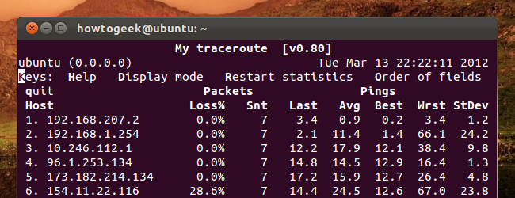

无论你是要下载文件、诊断网络问题、管理网络接口，还是查看网络的统计数据，都有终端命令可以来完成。这篇文章收集了久经考验靠谱的命令，也收集了几个比较新的命令。

多数命令都可以在图形桌面执行，即使是没什么终端使用经验的`Linux`用户也会常常执行命令来使用`ping`或是其它的网络诊断工具。

`curl` & `wget`
---------------------

使用`curl`或`wget`命令，不用离开终端就可以下载文件。如你用`curl`，键入`curl -O`后面跟一个文件路径。`wget`则不需要任何选项。下载的文件在当前目录。

```bash
curl -O website.com/file
wget website.com/file
```

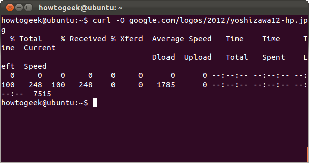

`ping`
---------------------

`ping`发送`ECHO_REQUEST`包到你指定的地址。这样你可以很方便确认你的电脑和`Internet`或是一个指定的`IP`地址是不是通的。使用`-c`开关，可以指定发送`ECHO_REQUEST`包的个数。

```bash
ping -c 4 google.com
```

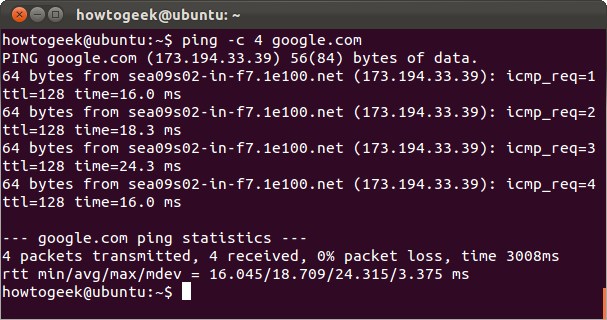

`tracepath` & `traceroute`
---------------------

`tracepath`命令和`traceroute`命令功能类似，但不需要`root`权限。并且`Ubuntu`预装了这个命令，`traceroute`命令没有预装的。`tracepath`追踪出到指定的目的地址的网络路径，并给出在路径上的每一跳（`hop`）。如果你的网络有问题或是慢了，`tracepath`可以查出网络在哪里断了或是慢了。

```bash
tracepath example.com
```

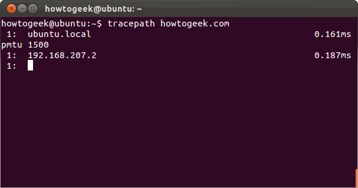

`mtr`
---------------------

`mtr`命令把`ping`命令和`tracepath`命令合成了一个。`mtr`会持续发包，并显示每一跳ping所用的时间。也会显示过程中的任何问题，在下面的示例中，可以看到在第6跳丢了超过20%的包。

```bash
mtr howtogeek.com
```

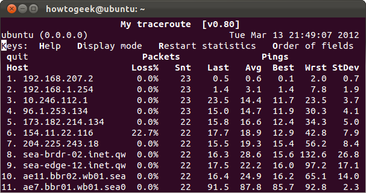

键入`q`或是`CTRL + C`来退出命令。

`host`
---------------------

`host`命令用来做`DNS`查询。如果命令参数是域名，命令会输出关联的`IP`；如果命令参数是`IP`，命令则输出关联的域名。

```bash
host howtogeek.com
host 208.43.115.82
```

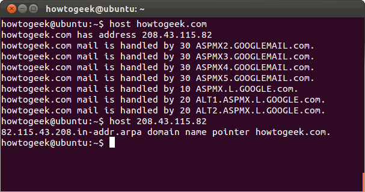

`whois`
---------------------

`whois`命令输出指定站点的`whois`记录，可以查看到更多如谁注册和持有这个站点这样的信息。

```bash
whois example.com
```

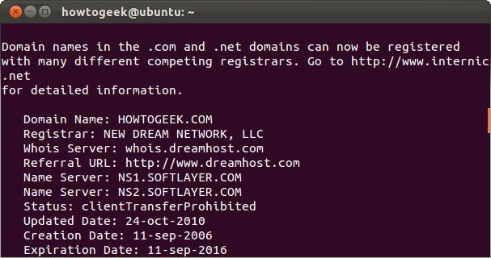

`ifplugstatus`
---------------------

`ifplugstatus`命令可以告诉你是否有网线插到在网络接口上。这个命令`Ubuntu`没有预装，通过下面的命令来安装：

```bash
sudo apt-get install ifplugd
```

这个命令可以查看所有网络接口的状态，或是指定网络接口的状态：

```bash
ifplugstatus
ifplugstatus eth0
```

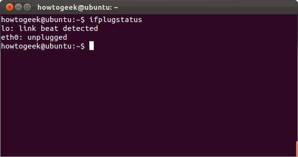

命令输出『`Link beat detected`』（检测到连接心跳）表示有网线插着，如没有则会输出『`unplugged`』（未插入）。

`ifconfig`
---------------------

`ifconfig`用于输出网络接口配置、调优和Debug的各种选项。可以快捷地查看`IP`地址和其它网络接口的信息。键入`ifconfig`查看所有启用的网络接口的状态，包括它们的名字。可以指定网络接口的名字来只显示这一个接口的信息。

```bash
ifconfig
ifconfig eth0
```

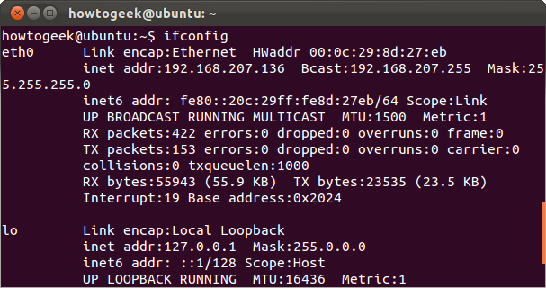

`ifdown` & `ifup`
---------------------

`ifdown`和`ifup`命令和运行`ifconfig up`，`ifconfig down`的功能一样。给定网络接口的名字可以只禁用或启用这一个接口。需要`root`权限，所以在`Ubuntu`上需要使用`sudo`来运行。

```bash
sudo ifdown eth0
sudo ifup eth0
```

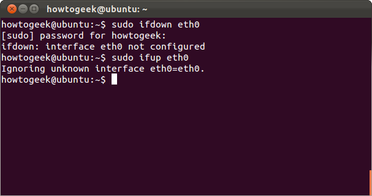

在`Linux`桌面系统上运行这2个命令，很可能会输出出错信息。`Linux`桌面通过使用网络管理器（`NetworkManager`）来管理你的网络接口。不过在没有安装网络管理器的服务器版上，这2个命令仍然可用。

如果确实要在命令行上配置网络管理器，用`nmcli`命令。

`dhclient`
---------------------

`dhclient`命令可以释放你的电脑的`IP`地址并从`DHCP`服务器上获得一个新的。需要`root`权限，所以在`Ubuntu`上需要`sudo`。无选项运行命令获取新`IP`，或指定`-r`开关来释放当前的`IP`地址。

```bash
sudo dhclient -r
sudo dhclient
```

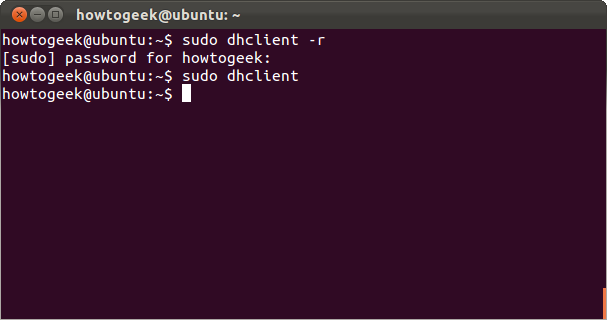

`netstat`
---------------------

`netstat`命令可以显示网络接口的很多统计信息，包括打开的`socket`和路由表。无选项运行命令显示打开的`socket`。

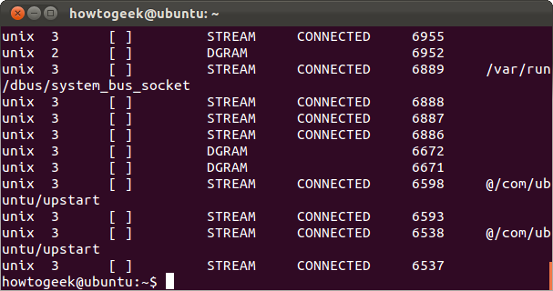

这条命令还有很多功能。比如，`netstat -p`命令可以显示打开的`socket`对应的程序。

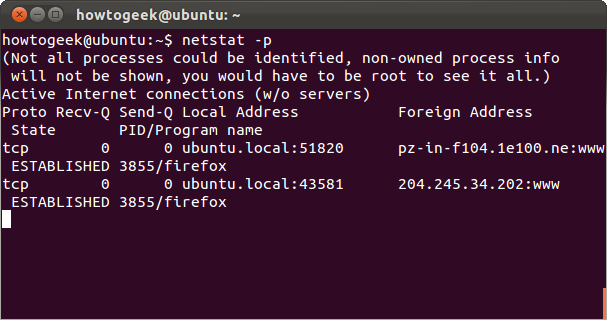

`netstat -s`则显示所有端口的详细统计信息。

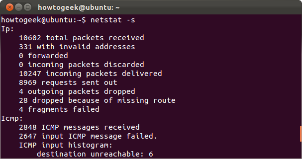
