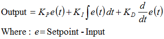

# 改善初学者的`PID`

## 简介

随着新版[`Arduino PID`库](http://www.arduino.cc/playground/Code/PIDLibrary)的发布，我决定写一个系列文章。上个版本的库虽然可靠，但并没有任何配套的代码说明。这次的目标是详细介绍代码为什么是这样实现。希望能对两类人有用：

- 对于`Arduino PID`库内部运作感兴趣的人能获得详尽的解释。
- 对于要自己编写`PID`算法的人可以了解我的实现方式，并能从中借用任何喜欢的部分。

这个目标口号会很艰难，但是我觉得找到了一种不太痛苦的方式来解释我的代码。我将从所谓的『初学者的`PID`』开始。然后逐步进行改进它，直到成为一个高效，强大的`PID`算法。

## 初学者的`PID`

下面是每个人一开始就学习的`PID`方程：



根据这个方程，我们几乎都会编写出像下面的`PID`控制器实现：

```c
/*working variables*/
unsigned long lastTime;
double Input, Output, Setpoint;
double errSum, lastErr;
double kp, ki, kd;
void Compute()
{
   /*How long since we last calculated*/
   unsigned long now = millis();
   double timeChange = (double)(now - lastTime);

   /*Compute all the working error variables*/
   double error = Setpoint - Input;
   errSum += (error * timeChange);
   double dErr = (error - lastErr) / timeChange;

   /*Compute PID Output*/
   Output = kp * error + ki * errSum + kd * dErr;

   /*Remember some variables for next time*/
   lastErr = error;
   lastTime = now;
}

void SetTunings(double Kp, double Ki, double Kd)
{
   kp = Kp;
   ki = Ki;
   kd = Kd;
}
```

`Compute()`被定期或不定期调用，并且运转得还行。不过，本系列文章目标可不是『运转得还行』。如果想要这段代码成为与工业级`PID`控制器相提并论的实现，还必须处理好一些关键问题：

1. **[采样时间](sample-time)**：当`PID`算法按固定间隔定期调用执行时，算法的效果是最佳的。如果算法能知道采样间隔，还可以简化一些内部数学运算。
2. **[微分冲击（`Derivative Kick`）](derivative-kick)**：并不是个最大的问题，但因为容易处理，所以我们先从这个问题入手。
3. **[动态调整更改（`On-The-Fly Tuning Changes`）](tuning-changes)**：实现良好的`PID`算法可以更改调整参数且不会引发内部运行的颠簸震荡。
4. **[减轻重置浪费](reset-windup)**：我们将研究什么是重置浪费，并实施具有附带利益的解决方案
5. **[开/关（自动/手动）](onoff)**：在大多数应用中，有时需要关闭`PID`控制器并手动调整输出，而不会干扰控制器
6. **[初始化](initialization)**：控制器首次打开时，我们需要“无扰动传输”。也就是说，我们不希望输出突然变得有些新的价值
7. **[控制器指导](improving-the-beginners-pid-direction)**：这最后一个并没有改变鲁棒性本身。它旨在确保用户输入带有正确符号的调整参数。
8. **[新增：测量比例](http://brettbeauregard.com/blog/2017/06/proportional-on-measurement-the-code/)**：添加此功能可以更轻松地控制某些类型的过程。

解决了所有这些问题后，我们将获得可靠的`PID`算法。我们也会（并非偶然）拥有Arduino `PID`库的最新版本中使用的代码。因此，无论您是尝试编写自己的算法，还是试图了解`PID`库中正在发生的事情，我都希望这对您有所帮助。让我们开始吧。  

更新：在所有代码示例中，我都使用了双精度。在`Arduino`上，双精度与浮点数相同（单精度）。真正的双精度对于`PID`而言是过大的杀伤力。如果您使用的语言是真正的双精度，我建议将所有双精度更改为浮点型。

[下一个>>](1-sample-time.md)

