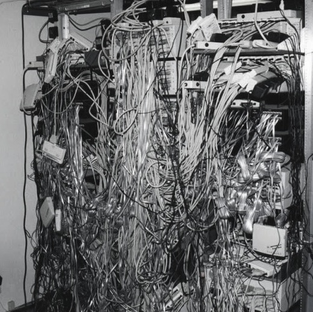
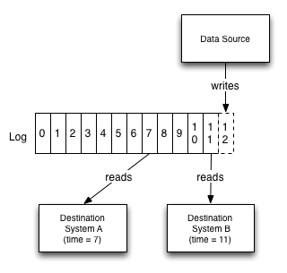
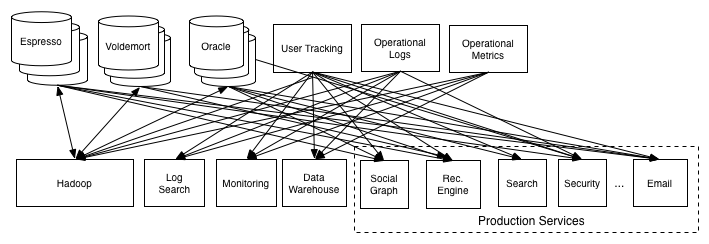
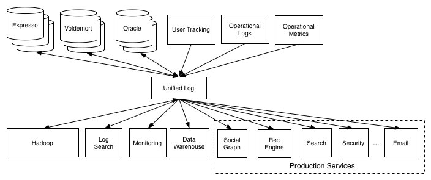
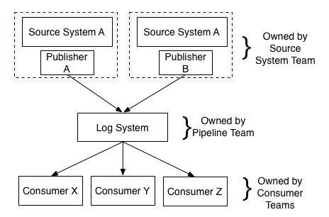

第二部分：数据集成
================================

1. [数据集成：两个难题](#数据集成两个难题)
    - [事件数据管道](#事件数据管道)
    - [专用数据系统（`specialized data systems`）的爆发](#专用数据系统specialized-data-systems的爆发)
1. [日志结构化的（`log-structured`）数据流](#日志结构化的log-structured数据流)
1. [在`LinkedIn`](#在linkedin)
1. [`ETL`与数据仓库的关系](#etl与数据仓库的关系)
1. [日志文件与事件](#日志文件与事件)
1. [构建可伸缩的日志](#构建可伸缩的日志)

我先解释一下我说的是『数据集成』（`data integration`）是什么，还有为什么我觉得它很重要，然后我们再来看看它是如何和日志建立关系的。

**数据集成 是指 使一个组织的所有数据 对 这个组织的所有的服务和系统 可用。**

『数据集成』还不是一个常见的用语，但是我找不到一个更好的。大家更熟知的术语[`ETL`](http://en.wikipedia.org/wiki/Extract,_transform,_load)
（**_【译注】_** `ETL`是`Extraction-Transformation-Loading`的缩写，即数据提取、转换和加载）
通常只是覆盖了数据集成的一个有限子集 —— 主要在关系型数据仓库的场景。但我描述的东西很大程度上可以理解为，将`ETL`推广至覆盖实时系统和处理流程。

你一定不会听到数据集成就兴趣盎然地屏住呼吸，并且天花乱坠的想到**_大数据_**的概念，
但尽管如此，我相信这个陈词滥调的『让数据可用』的问题是组织可以关注的更有价值的事情之一。

对数据的高效使用遵循一种[马斯洛的需要层次理论](http://en.wikipedia.org/wiki/Maslow%27s_hierarchy_of_needs)。
金字塔的基础部分包含捕获所有相关数据，能够将它们全部放到适当的处理环境中（可以是一个华丽的实时查询系统，或仅仅是文本文件和`python`脚本构成的环境）。
这些数据需要以统一的方式建模，以方便读取和处理。
一旦这些以统一的方式捕获数据的基本需求得到满足，那么在基础设施上以不同方法处理这些数据就变得理所当然 —— `MapReduce`、实时查询系统等等。

显而易见但值得注意的一点：如果没有可靠的、完整的数据流，`Hadoop`集群只不过是个非常昂贵而且安装麻烦的供暖器。
一旦有了数据和处理（`data and processing`），人们的关注点就会转移到良好的数据模型和一致且易于理解的语义这些更精致的问题上来。
最后，关注点会转移到更高级处理上 —— 更好的可视化、生成报表以及处理和预测算法。

以我的经验，大多数组织在这个数据金字塔的底部存在巨大的漏洞 —— 缺乏可靠的完整的数据流 ——
却想直接跳到高级数据模型技术上。这样做完全是本未倒置。

所以问题是，我们如何在组织中构建贯穿所有数据系统的可靠数据流？

数据集成：两个难题
----------------------

有两个趋势使数据集成变得更加困难。

### 事件数据管道

第一个趋势是增长的事件数据（`event data`）。事件数据记录的是发生的事情，而不是已存在的事情。
在`Web`系统中，这就意味着用户活动日志，还有为了可靠地操作和监控数据中心机器的价值而记录的机器级别的事件和统计数字。
人们倾向于称它们为『日志数据（`log data`）』，因为它们经常被写到应用日志中，但这样的说法混淆了形式与功能。
这些数据是现代`Web`的核心：归根结底，`Google`的财富来自于建立在点击和展示（`clicks and impressions`）上的相关性管道（`relevance pipeline`），而这些点击和展示正是事件。

这样的事情并不是仅限于`Web`公司，只是`Web`公司已经完全数字化，所以更容易完成。财务数据长久以来一直是以事件为中心的。
[`RFID`](http://en.wikipedia.org/wiki/RFID)（无线射频识别）使得能对物理设备做这样的跟踪。
随着传统的业务和活动的[数字化（`digitization`）](http://online.wsj.com/article/SB10001424053111903480904576512250915629460.html)，
我认为这个趋势仍将继续。

这种类型的事件数据记录了发生的事情，往往比传统数据库应用要大好几个数量级。这对于处理提出了重大的挑战。

### 专用数据系统（`specialized data systems`）的爆发

第二个趋势来自于专用数据系统的[爆发](http://citeseerx.ist.psu.edu/viewdoc/summary?doi=10.1.1.68.9136)，这些数据系统在最近五年开始流行并且可以免费获得。
专门用于[`OLAP`](https://github.com/metamx/druid/wiki)、[搜索](http://www.elasticsearch.org/)、[简单](http://www.rethinkdb.com/) [在线](http://www.slideshare.net/amywtang/espresso-20952131) [存储](http://hadoop.apache.org/)、 [批处理](http://hadoop.apache.org/)、[图分析（`graph analysis`）](http://graphlab.org/) [等](http://redis.io/) [等](http://spark.incubator.apache.org/) 的数据系统已经出现。

更加多样化的数据同时变成更加大量，而且这些数据期望放到更多的系统中，这些需求同时要解决，导致了一个巨大的数据集成问题。

日志结构化的（`log-structured`）数据流
----------------------

处理系统之间的数据流，日志是最自然的数据结构。解决方法很简单：

**提取所有组织的数据，并放到一个用于实时订阅的中心日志中。**

每个逻辑数据源都可以用它自己的日志作为模型。
一个数据源可以看作 一个输出事件日志的应用（如点击或页面的浏览），或是 一个接受修改的数据库表。
每个订阅消息的系统都尽可能快的从日志读取信息，将每条新的记录应用到自己的存储中，同时向前滚动日志文件中的自己的位置。
订阅方可以是任意一种数据系统 —— 缓存、`Hadoop`、另一个网站中的另一个数据库、一个搜索系统，等等。

举个例子，日志概念为每个变更提供了逻辑时钟，所有的订阅方都可以比较这个逻辑时钟。
这极大简化了如何去推断不同的订阅系统的状态彼此是否一致的，因为每个系统都持有了一个读到哪儿的『时间点』。

为了让讨论更具体些，我们考虑一个简单的案例，有一个数据库和一组缓存服务器集群。
日志提供了一个方法可以同步更新到所有这些系统，并推断出每个系统的所处在的时间点。
我们假设做了一个写操作，对应日志记录`X`，然后要从缓存做一次读操作。
如果我们想保证看到的不是过时的数据，我们只需保证，不要去读取那些复制操作还没有跟上`X`的缓存即可。

日志也起到缓冲的作用，使数据的生产异步于数据的消费。有许多原因使得这一点很重要，特别是在多个订阅方消费数据的速度各不相同的时候。
这意味着一个数据订阅系统可以宕机或是下线维护，在重新上线后再赶上来：订阅方可以按照自己的节奏来消费数据。
批处理系统如`Hadoop`或者是一个数据仓库，或许只能每小时或者每天消费一次数据，而实时查询系统可能需要及时到秒。
无论是起始的数据源还是日志都感知感知各种各样的目标数据系统，所以消费方系统的添加和删除无需去改变传输管道。

特别重要的是：目标系统只知道日志，而不知道来源系统的任何细节。
无论是数据来自于一个`RDBMS`、一种新型的键值存储，还是由一个不包含任何类型实时查询的系统所生成的，消费方系统都无需关心。
这似乎是一个小问题，但实际上却是至关重要的。

> 

>
> [『Each working data pipeline is designed like a log; each broken data pipeline is broken in its own way.』  
『工作的数据管道都是设计得像日志；而损坏的数据管道各有各的损坏。』  
> —— 列夫 · 尼古拉耶维奇 · 托尔斯泰 （由笔者改写）](http://en.wikipedia.org/wiki/Anna_Karenina_principle)
>
> **_【译注】_** [_托尔斯泰_](https://zh.wikipedia.org/zh-cn/%E5%88%97%E5%A4%AB%C2%B7%E6%89%98%E7%88%BE%E6%96%AF%E6%B3%B0) 的『[_安娜·卡列尼娜_](https://zh.wikipedia.org/zh-cn/%E5%AE%89%E5%A8%9C%C2%B7%E5%8D%A1%E5%88%97%E5%B0%BC%E5%A8%9C) 原理』的原文：  
> Happy families are all alike; every unhappy family is unhappy in its own way.  
> 幸福的家庭都是相似的，不幸的家庭各有各的不幸。

这里我使用术语『日志』取代了『消息系统』或者『发布-订阅』，因为在语义上明确得多，并且准确得多地描述了在实际实现中支持数据复制时你所要做的事。
我发现『发布订阅』只是表达出了消息的间接寻址（`indirect addressing of messages`） ——
如果你去比较两个发布-订阅的消息系统的话，会发现他们承诺的是完全不同的东西，而且大多数模型在这一领域没什么用。
你可以认为日志是一种有持久性保证和强有序（`strong ordering`）语义的消息系统。
在分布式系统中，这个通信模型有时有个（有些可怕的）名字叫做[原子广播（`atomic broadcast`）](http://en.wikipedia.org/wiki/Atomic_broadcast)。

值得强调的是，日志仍然只是基础设施，并不是精通数据流这个故事的结束：
故事的剩余部分围绕着元数据（`metadata`)、`schemas`、兼容性以及处理数据结构及其演化的所有细节来展开。
但是，除非有一种可靠的通用的方式来处理数据流的机制，否则语义细节总是次要的。

在`LinkedIn`
---------------------------

随着`LinkedIn`从集中式关系数据库过渡到一套分布式系统，我注意到数据集成的问题在迅速地演变。

目前我们主要的数据系统包括：

- [搜索](http://data.linkedin.com/projects/search)
- [`Social Graph`](http://engineering.linkedin.com/real-time-distributed-graph/using-set-cover-algorithm-optimize-query-latency-large-scale-distributed)
- [`Voldemort`](http://project-voldemort.com/) （键值存储）
- [`Espresso`](http://data.linkedin.com/projects/espresso) （文档存储）
- [推荐引擎](http://www.quora.com/LinkedIn-Recommendations/How-does-LinkedIns-recommendation-system-work)
- `OLAP`查询引擎
- [`Hadoop`](http://hadoop.apache.org/)
- [`Terradata`](http://www.teradata.com/)
- [`Ingraphs`](http://engineering.linkedin.com/52/autometrics-self-service-metrics-collection) （监控图表和指标服务）

每一个都是专用的分布式系统，在各自的专门领域提供高级的功能。

使用日志作为数据流的这个想法，甚至在我到这里之前，就已经在`LinkedIn`的各个地方开始浮现了。
我们开发的最早的一个基础设施是一个称为[`databus`](https://github.com/linkedin/databus)的服务，
它在我们早期的`Oracle`表上提供了一种日志缓存的抽象，用于可伸缩地订阅数据库修改，给我们的`social graph`和搜索索引输入数据。

我先简单介绍一些历史以提供讨论的上下文。在发布我们自己键值存储之后，大约是2008年我开始参与这个项目。
我接着的一个项目是把一个运行的`Hadoop`部署用起来，迁移我们的一些推荐处理上来。
由于缺乏这方面的经验，我们只计划了几周时间完成数据的导入导出，剩下的时间则用来实现复杂的预测算法。
就这样我们开始了长途跋涉。

我们本来计划是仅仅将数据从现存的`Oracle`数据仓库中剖离。
但是我们首先发现将数据从`Oracle`中迅速取出简直是一个黑魔法（`dark art`）。
更糟的是，数据仓库的处理过程并不适合于 我们为`Hadoop`设计的生产批处理过程 ——
大部分处理都是不可逆的，并且与要生成的具体报表相关。
最终我们采取的办法是，避免使用数据仓库，直接访问源数据库和日志文件。
最后，我们实现了一个管道，用于完成[加载数据到我们的键值存储](http://data.linkedin.com/blog/2009/06/building-a-terabyte-scale-data-cycle-at-linkedin-with-hadoop-and-project-voldemort)并生成结果。

这种普通常见的数据拷贝最终成为原来开发项目的主要内容之一。
糟糕的是，只要在任何时间任意管道有一个问题，`Hadoop`系统基本上就是废的 ——
在错误的数据基础上运行复杂的算法只会产生更多的错误数据。

虽然我们已经使用了一种很通用的构建方式，但是每个数据源都需要自定义的安装配置。这也被证明是大量错误与失败的根源。
我们用`Hadoop`实现的网站功能开始流行起来，而我们发现自己有一大把需要协作的工程师。
每个用户都有他们想要集成的一大把的系统，并且想要导入的一大把新数据源。

有些东西在我面前开始渐渐清晰起来。

首先，我们已建成的通道虽然有一些杂乱，但实际上是极有价值的。
仅在一个新的处理系统（`Hadoop`）中让数据可用于处理 就开启了大量的可能性。
基于这些数据过去很难实现的计算如今已变为可能。
许多新的产品和分析技术都来源于把多个数据片块放在一起，这些数据过去被锁定在特定的系统中。

>    
> 古希腊时代的`ETL`。并没有太多变化。

第二，可靠的数据加载需要数据通道的深度支持，这点已经变得很清晰了。
如果我们可以捕获所有我们需要的结构，就可以使得`Hadoop`数据全自动地加载，
这样不需要额外的手动操作就可以添加新的数据源或者处理`schema`变更 ——
数据就会自动的出现在`HDFS`，并且`Hive`表就会自动的为新数据源生成恰当的列。

第三，我们的数据覆盖率仍然很低。
如果看一下`LinkedIn`所有数据在`Hadoop`中可用的比率，仍然很不完整。
相比接入并运转一个新数据源所要做的努力，完整接入一个数据源更不容易。

我们曾经推行的方式是为每个数据源和目标构建自定义的数据加载，很显然这是不可行的。
我们有几十个数据系统和数据仓库。把这些系统和仓库联系起来，就会导致任意两两系统间构建自定义的管道，如下所示：

需要注意的是数据是双向流动的：例如许多系统（数据库、`Hadoop`）同时是数据传输的来源和目的。
这就意味着我们我们最后要为每个系统建立两个通道：一个用于数据输入，一个用于数据输出。

这显然需要一大群人，而且也不具有可操作性。随着我们接近完全连接，最终我们会有差不多`O(N^2)`条管道。

要避免上面的问题，我们需要像这样的通用方式：

我们需要尽可能的将每个消费者与数据源隔离。理想情形下，它们应该只与一个单独的数据源集成，就能访问到所有数据。

这个思想是增加一个新的数据系统 —— 它可以作为数据来源或者数据目的地 ——
集成工作只需连接这个新系统到一个单独的管道，而无需连接到每个数据消费方。

这样的经历使得我专注于创建[`Kafka`](http://kafka.apache.org/)，把 我们所知的消息系统的特点 与 在数据库和分布式系统内核常用的日志概念 结合起来。
我们首先需要一个实体作为所有的活动数据的中心管道，并逐步的扩展到其他很多的使用方式，包括`Hadoop`之外的数据、数据监控等等。

在相当长的时间内，`Kafka`是独一无二的（有人会说是怪异） ——
作为一个底层设施，它既不是数据库，也不是日志文件收集系统，更不是传统的消息系统。
但是最近`Amazon`提供了非常非常类似`Kafka`的服务，称之为[`Kinesis`](http://aws.amazon.com/kinesis)。
相似度包括了分片（`partition`）处理的方式，数据的持有方式，甚至包括有点特别的`Kafka API`分类（分成高端和低端消费者）。
我很开心看到这些，这表明了你已经创建了很好的底层设施抽象，`AWS`已经把它作为服务提供！
他们对此的想法看起来与我所描述的完全吻合：
管道联通了所有的分布式系统，诸如`DynamoDB`,`RedShift`,`S3`等，同时作为使用`EC2`进行分布式流处理的基础。

`ETL`与数据仓库的关系
-------------------------

我们再来聊聊数据仓库。数据仓库旨在包含支撑数据分析的规整的集成的结构化数据。
这是一个非常好的理念。对不了解数据仓库概念的人来说，数据仓库的用法是：
周期性的从源数据库抽取数据，把它们转化为可理解的形式，然后把它导入中心数据仓库。
对于数据集中分析和处理，拥有高度集中的位置存放全部数据的规整副本对于数据密集的分析和处理是非常宝贵的资产。
在更高层面上，无论你使用传统的数据仓库`Oracle`还是`Teradata`或`Hadoop`，
这个做法不会有太多变化，可能[调整](http://searchdatamanagement.techtarget.com/definition/Extract-Load-Transform-ELT)一下抽取和加载数据的顺序。

数据仓库是极其重要的资产，它包含了的和规整的数据，但是实现此目标的机制有点过时了。

对于以数据为中心的组织，关键问题是把规整的集成的数据联结到数据仓库。
数据仓库是个批处理查询基础设施：它们适用于各类报表和临时性分析，特别是当查询包含了简单的计数、聚合和过滤。
但是如果批处理系统是唯一一个包含规整的完整的数据的仓库，
这就意味着，如果一个系统需要 实时数据输入的实时系统（如实时处理、实时搜索索引、实时监控等系统），这些数据是不可用的。

依我之见，`ETL`包括两件事。
首先，它是数据抽取和清理的处理 —— 本质上就是释放被锁在组织的各类系统中的数据，去除特定于系统的约束。
第二，依照数据仓库的查询重构数据，例如使其符合关系数据库类型系统，
强制使用星型`schema`（`star schema`）、雪花型`schema`（`snowflake schema`），可能会打散数据成高性能的[列](http://parquet.io/) [格式](http://docs.hortonworks.com/HDPDocuments/HDP2/HDP-2.0.0.2/ds_Hive/orcfile.html)（`column format`），等等。同时做好这两件事是有困难的。
这些集成仓库的规整的数据除了要索引到实时存储系统中，也应当可用于实时或是低时延处理中。

在我看来，正是因为这个原因有了额外好处：使得数据仓库`ETL`大大提升了**_组织级_**的可伸缩性（`scalable`）。
典型的问题是数据仓库团队要负责收集和整理组织中各个团队所生成的全部数据。
两边的收益是不对称的：数据的生产者常常并不知晓在数据仓库中数据的使用情况，
结果产生的数据，为了转成为可用的形式，抽取过程很难或是很繁重，转换过程很难统一规模化。
当然，中心团队的规模不可能跟上组织中其它团队增长，
结果数据的覆盖率总是参差不齐的，数据流是脆弱的，跟进变更是缓慢的。

较好的做法是有一个中央管道即日志，用定义良好的`API`来添加数据。
集成这个管道和提供良好的结构化的输入数据所需的职责由提供数据的生产者承担。
这意味着作为系统设计和实现一部分的生产者，在交付到中心通道时，
必须考虑其输出和输入的数据要有良好结构形式的问题。
新的存储系统的加入对于数据仓库团队是无关紧要的，因为他们现在只有一个中心结点去集成。
（**_【译注】_** 原来要集成的是其它各个相关的系统，工作是被简化了的）
数据仓库团队需只处理更简单的问题，从中心日志中加载结构化的输入数据、完成特定于他们系统的数据转换。

从上面讨论可以看出，当考虑采纳传统的数据仓库之外额外的数据系统时，组织级的伸缩性（`organizational scalability`）显得尤为重要。
例如，想为组织的所有的数据集提供搜索能力。
或者想为数据流的监控的次级监控（`sub-second monitoring`）添加实时数据趋势和告警。
无论是哪个情况，传统的数据仓库的基础设施，甚至是`Hadoop`集群都将不再适合。
更糟的是，用于支持数据加载的`ETL`处理管道可能输入不了数据到其它系统，
和带动不了要动用数据仓库这样的大企业下的那些基础设备。
这样的做法应该是不可行的，可能可以解释为什么多数组织对他们的所有数据很难轻松具备这样的能力。
反之，如果组织能导出标准的结构良好的数据，
那么任何新的系统要使用所有数据仅仅需要提供一个用于集成的管道接到中央管道上即可。

关于数据规整化和转换在哪里进行，这种架构也引出了的不同观点：

1. 在添加数据到公司全局日志之前，由数据的生产者完成。
1. 由在日志上的一个实时转换器完成，转换器生成一个新的转换过的日志。
1. 作为加载过程的一部分，由目标系统完成。

最好的模型是数据发布到日志之前由数据生产者完成数据规整化。
这样可以确保数据是处于规范形式（`canonical form`）的，
并且不需要保留数据 从原来生产系统的特定代码或是原来存储系统的维护方式所带来的任何遗留属性。
这些细节最好由产成数据的团队来处理，因为他们最了解他们自己的数据。
这个阶段所使用的任何逻辑都应该是无损的和可逆的。

可以实时完成的任何类型有附加值的转换操作都应该作为原始日志数据的后处理环节完成。
这类操作包括了事件数据的会话管理，或者附加上大家感兴趣的派生字段。
原始日志仍然是可用的，但这样的实时处理生产了包含增强数据（`augmented data`）的派生日志。

最后，只有针对目标系统的聚合操作才应该加到加载过程中。
比如可能包括在数据仓库中为分析和报表而做的把数据转化成特定的星型或者雪花状`schema`。
因为在这个阶段（一般比较自然地对应到传统的`ETL`处理阶段），现在处理的是一组规整得多和统一得多的流，
处理过程已经大大简化了。

日志文件与事件
---------------------

我们再来聊聊这种架构的附带的优势：支持解耦的事件驱动的系统。

在`Web`行业取得活动数据的典型方法是把打日志到文本文件中，
然后这些文本文件分解进入数据仓库或者`Hadoop`用于聚合和查询。
这做的问题和所有批处理的`ETL`做法一样：数据流耦合了数据仓库系统的能力和处理计划（`processing schedule`）。

在`LinkedIn`，是以在中心日志完成处理的方式构建事件数据。
`Kafka`做为中心的有多个订阅方的事件日志，定义数百种事件类型，
每种类型都会捕获一个特定动作类型的独特属性。
这样的方式覆盖从页面浏览、广告展示、搜索到服务调用、应用异常的方方面面。

为了进一步理解这一优势，设想一个简单的场景 —— 显示在工作职位页面提交的职位信息。
职位页面应当只包括显示职位所需的逻辑。
然而，在足够动态站点中，这很容易就变成与职位显示无关的额外逻辑的点缀。
例如，我们将对如下的系统进行集成：

1. 发送数据到`Hadoop`和数据仓库中，以做离线数据处理
1. 浏览计数，确保查看者不是一个内容爬虫
1. 聚合浏览信息，在职位提交者的分析页面显示
1. 记录浏览信息，确保合适地设置了用户的推荐职位的展示上限（不想重复地展示同样内容给用户）
1. 推荐系统可能需要记录浏览，以正确的跟踪职位的流行程度
1. 等等

用不了多久，简单的职位显示变得相当的复杂。
与此同时，还要增加职位显示的其它终端 —— 移动终端应用等等 ——
这样的逻辑必须继续实现，复杂程度被不断地提升。
更糟的是，我们需要交互的系统是多方需求交织缠绕在一起的 ——
负责显示职位的工程师需要知道多个其它系统和功能，才可以确保集成的正确。
这里仅是简单描述了问题，实际应用系统只会更加复杂。

『事件驱动』风格提供了简化这类问题的方案。
职位显示页面现在只负责显示职位并记录显示职位的信息，如职位相关属性、页面浏览者及其它有价值的信息。
其它所有关心这个信息的系统诸如推荐系统、安全系统、职位提交分析系统和数据仓库，只需订阅上面的输出数据进行各自的处理。
显示代码并不需要关注其它的系统，也不需要因为增加了数据的消费者而做改变。

构建可伸缩的日志
--------------------------

当然，把发布者与订阅者分离不再是什么新鲜事了。
但是如果要给一个需要按用户扩展的（`consumer-scale`）网站提供多个订阅者的实时提交日志，
那么可伸缩性就会成为你所面临的首要挑战。
如果我们不能创建快速、低成本和可伸缩的日志以满足实际大规模的使用，把日志用作统一集成机制只不过是个美好的幻想。

人们普遍认为分布式日志是缓慢的、重量级的抽象（并且通常只把它与『元数据』类的使用方式联系在一起，可能用`Zookeeper`才合适）。
但有了一个专注于大数据流的深思熟虑的实现可以打破上面的想法。
在`LinkedIn`，目前每天通过`Kafka`写入超过600亿条不同的消息。
（如果算上[数据中心之间镜像](http://kafka.apache.org/documentation.html#datacenters)的消息，那么这个数字会是数千亿。）

为了支持这样的规模，我们在`Kafka`中使用了一些技巧：

1. 日志分片
1. 通过批量读出和写入来优化吞吐量
1. 规避无用的数据拷贝

为了确保水平可扩展性，我们把日志进行切片：

每个分片的日志是有序的，但是分片之间没有全局的次序（这个有别于在你的消息中可能包含的挂钟时间）。
由写入者决定消息发送到特定的日志分片，大部分使用者以某种键值（如用户`id`）来进行分片。
追加日志时，分片方式在片段之间可以不需要协调，并且可以使系统的吞吐量与`Kafka`集群大小线性增长。

每个分片通过可配置数字指定数据复制的复本个数，每个复本都有一个分片日志完全一致的一份拷贝。
任何时候都有一个复本作为`leader`，如果`leader`出错了，会有一个复本接替成为`leader`。

缺少跨分片的全局顺序是个局限，但是我们没有发现它成为大问题。
事实上，与日志的交互一般来源于成百上千个不同的处理流程，所以为所有处理提供全局顺序没有意义。
转而需要的是，我们提供的每个分片有序的保证，和`Kafka`提供的 同一发送者发送给同一分区的消息以相同的顺序交付到接收者 的保证。

日志，和文件系统一样，对于顺序读写可以方便地优化。日志可以把小的读写合成大的高吞吐量的操作。
`Kafka`非常积极做这方面的优化。客户端向服务器端的数据发送、磁盘写入、服务器之间复制、到消费者数据传递和数据提交确认
都会做批处理。

最后，`Kafka`使用简单的二进制格式维护内存日志、磁盘日志和传送网络数据。这使得我们可以使用包括『[0拷贝的数据传输](https://www.ibm.com/developerworks/library/j-zerocopy)』在内的大量的优化机制。

这些优化的积累效应是往往以磁盘和网络的速度在读写数据，即使维护的数据集大大超出内存大小。

这些自卖自夸的介绍不意味着是关于`Kafka`的主要内容，我就不再深入细节了。
`LinkedIn`方案的更细节说明在[这儿](http://sites.computer.org/debull/A12june/pipeline.pdf)，`Kafka`设计的详细说明在[这儿](http://kafka.apache.org/documentation.html#design)，你可以读一下。

-----------------

[« 第一部分：日志是什么？](part1-what-is-a-log.md)　　　　[第三部分：日志和实时流处理 »](part3-logs-and-real-time-stream-processing.md)
