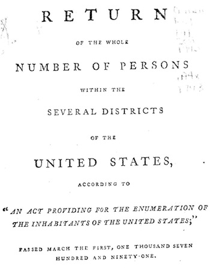
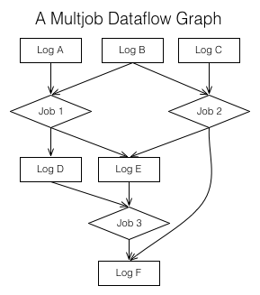

第三部分：日志与实时流处理
=================================

1. [数据流图（`data flow graphs`）](#数据流图data-flow-graphs)
1. [有状态的实时流处理](#有状态的实时流处理)
1. [日志合并（`log compaction`）](#日志合并log-compaction)

到目前为止，我只讲述了系统之间拷贝数据的理想机制。但是在存储系统之间搬运字节不是所要讲述内容的全部。
最终会发现，『日志』是流的另一种说法，
并且日志是[流处理](http://highlyscalable.wordpress.com/2013/08/20/in-stream-big-data-processing/)的核心。

但是，等会儿，流处理到底是什么呢？

如果你是上世纪90年代晚期或者21世纪初[数据库](http://cs.brown.edu/research/aurora/vldb03_journal.pdf) [文化](http://db.cs.berkeley.edu/papers/cidr03-tcq.pdf)或者成功了一半的[数据](http://www-03.ibm.com/software/products/us/en/infosphere-streams) [基础设施](http://en.wikipedia.org/wiki/StreamBase_Systems) [产品](http://en.wikipedia.org/wiki/Truviso)的爱好者，那么你就可能会把流处理与建创`SQL`引擎或者『箱子和箭头』（`boxes and arrows`）接口用于事件驱动的处理联系起来。

如果你关注大量出现的开源数据库系统，你就可能把流处理和一些这领域的系统关联起来，
比如[`Storm`](http://storm-project.net/)、[`Akka`](http://akka.io/)、[`S4`](http://incubator.apache.org/s4)和[`Samza`](http://engineering.linkedin.com/distributed-systems/log-what-every-software-engineer-should-know-about-real-time-datas-unifying)。
但是大部分人会把这些系统看为异步消息处理系统，与支持群集的远程过程调用（`RPC`）层没什么差别
（而事实上这一领域一些系统确实是如此）。

这些观点都有一些局限性。流处理即与`SQL`无关，也不局限于实时流处理。
还没有根本的原因，限制你不能使用多种不同的语言来表达计算，处理昨天的或者一个月之前的流数据。

我把流处理视为更广泛的概念：持续数据流处理的基础设施。
我认为计算模型可以像`MapReduce`或者分布式处理框架一样通用，但是有能力生成低时延的结果。

处理模型的真正驱动力是数据收集方法。成批收集数据自然是批处理。当数据是持续收集的，自然也应该持续不断地处理。

美国的统计调查是一个成批收集数据的经典例子。
统计调查周期性的开展，用的是蛮力调查，通过挨门挨户的走访统计美国公民的信息。
在1790年统计调查刚刚开始，这样做是很合理的。
那时的数据收集本质就是面向批处理的，包括了骑马到周边人家，用纸笔记录，然后把成批的记录运输到人们统计数据的中心站点。
现在，在描述这个统计过程时，人们立即会想到为什么我们不保留出生和死亡的记录，这样就可以算出人口统计信息，这些信息或是持续即时计算出来或者按需要时间隔计算。

这是一个极端的例子，但是现在大量的数据传输处理仍然依赖于周期性的转录和批量的传输和集成。
处理批量转录数据的唯一方法就是批量的处理。
但是随着这些批处理被持续的数据输入所取代，人们自然而然的开始向持续处理转变，以平滑地使用所需的处理资源并且减少延迟。

例如在`LinkedIn`几乎完全没有批量数据收集。我们大部分的数据要么是活动数据或者要么是数据库变更，两者都是不间断地发生的。
事实上，你想到的任何商业业务，底层的机制几乎都是不间断的处理，正如*Jack Bauer*所说的，事件的发生是实时的。
当数据以成批的方式收集，几乎总是由这些原因所致：有一些人为的步骤；缺少数字化；或是非数字化流程的历史古董不能自动化。
当使用邮件或者人工方式，传输和处理数据是非常缓慢的。刚开始转成自动化时，总是保持着原来流程的形式，所以这样的情况会持续相当长的时间。

每天运行的『批量』处理作业常常在模拟一种窗口大小是一天的持续计算。
当然，底层的数据其实总是在变化着的。
在`LinkedIn`，这样的做法如此之常见（并且在`Hadoop`做到这些的实现机制如此之复杂），
以至于我们实现了一整套[框架](http://engineering.linkedin.com/datafu/datafus-hourglass-incremental-data-processing-hadoop)来管理增量的`Hadoop`工作流。

由此看来，对于流处理我很容易得出不同观点：
它处理的是包含时间概念的底层数据并且不需要静态的数据快照，
所以可以以用户可控频率生产输出而不是等待数据集的『都』到达后再生产输出（**_【译注】_** 数据是会持续的，所以实际上不会有『都』达到的时间点）。
从这个角度上讲，流处理是广义上的批处理，随着实时数据的流行，流处理会是很重要处理方式。

那么，为什么流处理的传统观点大家之前会认为更合适呢？
我个人认为最大的原因是缺少实时数据收集，使得持续处理之前是学术性的概念。

我觉得，是否缺少实时数据的收集决定了商用流处理系统的命运。
当他们的客户还是用面向文件的每日批量处理完成`ETL`和数据集成时，
建设流处理系统的公司专注于提供处理引擎来连接实时数据流，而结果是当时几乎没有人真地有实时数据流。
其实我在`LinkedIn`工作的初期，有一家公司想把一个非常棒的流处理系统卖给我们，
但是因为当时我们的所有数据都按小时收集在的文件里，
所以用上这个系统我们能做到的最好效果就是在每小时的最后把这些文件输入到流处理系统中。
他们意识到这是个普遍问题。
下面的这个异常案例实际上是证明上面规律：
流处理获得一些成功的一个领域 —— 金融领域，这个领域在过去，实时数据流就已经标准化，并且流处理已经成为了瓶颈。

甚至于在一个健康的批处理的生态中，我认为作为一种基础设施风格，流处理的实际应用能力是相当广阔的。
我认为它填补了实时数据请求/响应服务和离线批量处理之间的缺口。现代的互联网公司，我觉得大约25%的代码可以划分到这个情况。

事实证明，日志解决了流处理中最关键的一些技术问题，后面我会进一步讲述，
但解决的最大的问题是日志使得多个订阅者可以获得实时的数据输入。
对技术细节感兴趣的朋友，我们已经开源了[`Samza`](http://samza.apache.org/)，
它正是基于这些理念建设的一个流处理系统。
很多这方面的应用的更多技术细节我们在[此文档](http://samza.apache.org/learn/documentation/latest/)中有详细的描述。

数据流图（`data flow graphs`）
------------------

流处理最有趣的特点是它与流处理系统的内部组织无关，
但是与之密切相关的是，流处理是怎么扩展了之前在数据集成讨论中提到的认识：输入数据（`data feed`）是什么。
我们主要讨论了原始数据（`primary data`）的`feeds` 或说 日志 —— 各种系统执行所产生的事件和数据行。
但是流处理允许我们包括了由其它`feeds`计算出的`feeds`。
在消费者看来，这些派生的`feeds`和 用于生成他们的原始数据的`feeds` 看下来没什么差别。
这些派生的`feeds`可以按任意的复杂方式封装组合。

让我们再深入一点这个问题。
对于我们的目标，流处理作业是指从日志读取数据和将输出写入到日志或其它系统的任何系统。
用于输入和输出的日志把这些处理系统连接成一个处理阶段的图。
事实上，以这样的风格使用中心化的日志，你可以把组织全部的数据抓取、转化和工作流仅仅看成是一系列的写入它们的日志和处理过程。

流处理器根本不需要高大上的框架：
可以是读写日志的一个处理或者一组处理过程，但是为了便于管理处理所用的代码，可以提供一些额外的基础设施和支持。

在集成中日志的目标是双重的：

首先，日志让各个数据集可以有多个订阅者并使之有序。
让我们回顾一下『状态复制』原理来记住顺序的重要性。
为了更具体地说明，设想一下从数据库中更新数据流 —— 如果在处理过程中把对同一记录的两次更新重新排序，可能会产生错误的输出。
这里的有序的持久性要强于`TCP`之类所提供的有序，因为不局限于单一的点对点链接，并且在流程处理失败和重连时仍然要保持有序。

其次，日志提供了处理流程的缓冲。
这是非常基础重要的。如果多个处理之间是非同步的，那么生成上行流数据的作业生成数据可能比另一个下行流数据作业所能消费的更快。
这种情况下，要么使处理进程阻塞，要么引入缓冲区，要么丢弃数据。
丢弃数据似乎不是个好的选择，而阻塞处理进程，会使得整个的数据流的图被迫中止处理。
日志是一个非常非常大的缓冲，允许处理进程的重启或是失败，而不影响流处理图中的其它部分的处理速度。
要扩展数据流到一个更庞大的组织，这种隔离性极其重要，整个处理是由组织中不同的团队提供的处理作业完成的。
不能因为某个作业发生错误导致影响前面作业，结果整个处理流程都被卡住。

[`Storm`](http://storm-project.net/)和[`Sama`](http://samza.apache.org/)都是按这种风格构建，能用`kafka`或其它类似的系统作为它们的日志。

有状态的实时流处理
------------------------

一些实时流处理做的只是无状态的单次记录的转换，但有很多使用方式需要在流处理的某个大小的时间窗口内进行更复杂的计数、聚合和关联（`join`）操作。
比如，给一个的事件流（如用户点击的流）附加上做点击操作用户的信息，
—— 实际上即是关联点击流到用户的账户数据库。
这类流程最终总是要处理者维护一些状态信息：
比如在计算一个计数时，需要维护到目前为止的计数器。
在处理者可能挂掉的情况下，如何维护正确的状态？

最简单的方案是把状态保存在内存中。但是如果处理流程崩溃，会丢失中间状态。
如果状态是按窗口维护的，处理流程只能会回退到日志中窗口开始的时间点上。
但是，如果计数的时间窗口是1个小时这么长，那么这种方式可能不可行。

另一个方案是简单地存储所有的状态到远程的存储系统，通过网络与这些存储关联起来。
但问题是没了数据的局部性并产生很多的网络间数据往返（`network round-trip`）。

如何才能即支持像处理流程一样分片又支持像『表』一样的存储呢？

回顾一下关于表和日志二象性的讨论。它正好提供了把流转换成与这里我们处理中所需的表的工具，同时也是一个解决表的容错的处理机制。

流处理器可以把它的状态保存在本地的『表』或『索引』中 —— [`bdb`](http://www.oracle.com/technetwork/products/berkeleydb)、[`leveldb`](https://code.google.com/p/leveldb)
甚至是些更不常见的组件，如[`Lucene`](http://lucene.apache.org/) 或[`fastbit`](https://sdm.lbl.gov/fastbit)索引。
这样一些存储的内容可以从它的输入流生成（可能做过了各种转换后的输入流）。
通过记录关于本地索引的变更日志，在发生崩溃、重启时也可以恢复它的状态。
这是个通用的机制，用于保持 任意索引类型的分片之间相互协作（`co-partitioned`）的本地状态 与 输入流数据 一致。

当处理流程失败时，可以从变更日志中恢复它的索引。
每次备份时，即是日志把本地状态转化成一种增量记录。

这种状态管理方案的优雅之处在于处理器的状态也是做为日志来维护。
我们可以把这个日志看成是数据库表变更的日志。
事实上，这些处理器本身就很像是自维护的分片之间相互协作的表。
因为这些状态本身就是日志，所以其它处理器可以订阅它。
如果处理流程的目标是更新结点的最后状态并且这个状态又是流程的一个自然的输出，那么这种方式就显得尤为重要。

再组合使用上用于解决数据集成的数据库输出日志，日志和表的二象性的威力就更加明显了。
从数据库中抽取出来的变更日志可以按不同的形式索引到各种流处理器中，以关联到事件流上。

在`Samza`和这些大量[实际例子](http://samza.apache.org/learn/documentation/0.7.0/container/state-management.html)中，
我们说明了这种风格的有状态流处理管理的更多细节。

日志合并（`log compaction`）
------------------------

当然，我们不能奢望一直保存着全部变更的完整日志。
除非想要使用无限空间，日志总是要清理。
为了让讨论更具体些，我会介绍一些`Kafka`这方面的实现。
在`Kafka`中，清理有两种方式，取决于数据包括的是键值存储的更新还是事件数据。
对于事件数据，`Kafka`支持仅维护一个窗口的数据。通常，窗口配置成几天，但窗口也可以按空间大小来定。
对于键值存储的更新，尽管完整日志的一个优点是可以回放以重建源系统的状态（一般是另一个系统中重建）。

但是，随着时间的推移，保持完整的日志会使用越来越多的空间，并且回放的耗时也会越来越长。
因此在`Kafka`中，我们支持不同类型的保留方式。
我们删除过时的记录（如这些记录的主键最近更新过）而不是简单的丢弃旧日志。
这样做我们仍然保证日志包含了源系统的完整备份，但是现在我们不再重现原系统曾经的所有状态，仅是最近的哪些状态。
这一功能我们称之为[日志合并](https://cwiki.apache.org/confluence/display/KAFKA/Log+Compaction)。

-----------------

[« 第二部分：数据集成](part2-data-integration.md)　　　　[第四部分：系统构建（`system building`） »](part4-system-building.md)
