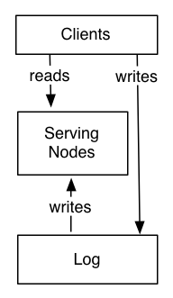
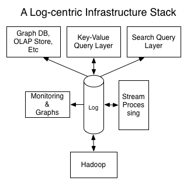

第四部分：系统构建（`system building`）
===============================

1. [分解单品方式而不是打包套餐方式（`Unbundling`）？](#分解单品方式而不是打包套餐方式unbundling)
1. [日志在系统架构中的地位](#日志在系统架构中的地位)

最后我要讨论的是在线数据系统设计中日志的角色。

日志服务在分布式数据库中服务于数据流 可以类比 日志服务在大型组织机构中服务于数据集成。
在这两个应用场景中，日志要解决的问题 都是 数据流、一致性和可恢复性。
如果组织不是一个很复杂的分布式数据系统呢，它究竟是什么？

分解单品方式而不是打包套餐方式（`Unbundling`）？
-----------------

如果你换个角度，可以把组织的系统和数据流整体看做整个一个分布式数据：
把所有独立的面向查询的系统（如`Redis`、`SOLR`、`Hive`表，等等）看做只是你的数据的特定的索引；
把流处理系统（如`Storm`、`Samza`）看做只是一种很成熟的触发器和视图的具体机制。
我注意到，传统的数据库人员非常喜欢这样的观点，因为他们终于能解释通，这些不同的数据系统到底是做什么用的
—— 它们只是不同的索引类型而已！

不可否认这段时间涌现了大量类型的数据系统，但实际上，这方面的复杂性早就存在。
即使是在关系数据库的鼎盛时期，组织里就有种类繁多的关系数据库！
因为大型机，所有的数据都存储在相同的位置，所以可能并没有真正的数据集成。
有很多推动力要把数据分离到多个系统：数据伸缩性、地理地域、安全性和性能隔离是最常见的。
这些问题可以通过一个好的系统来解决：
比如组织使用单个`Hadoop`保存所有数据来服务大量各式各样的客户，这样做是可能的。

所以处理的数据向分布式系统变迁的过程中，已经有了个可能的简单方法：
把大量的不同系统的小实例合到少数的大集群中。

许多的系统还不足好到支持这个方法：它们没有安全，或者不能保证性能隔离性，或者伸缩性不够好。
不过这些问题都是可以解决的。

依我之见，不同系统大量涌现的原因是构建分布式数据系统的难度。
把关注点消减到单个查询类型或是用例，各个系统可以把关注范围控制到一组能构建出来的东西上。
但是把全部这些系统运行起来，这件事有非常多的复杂性。

我觉得解决这类问题将来有三个可能的方向：

第一种可能性是延续现状：各个分离的系统在往后很长的一段时间里基本保持不变。
发生这种可能要么是因为建设分布式系统的困难很难克服，
要么系统的专用化（`specialization`）能让各个系统的便得性（`convenience`）和能力（`power`）达到一个新的高度。
只要现状不变，为了能够使用数据，数据集成问题将仍会最核心事情之一。
如果是这样，用于集成数据的外部日志将会非常的重要。

第二种可能性是一个统一合并的系统（`re-consolidation`），这个系统具备足够的通用性，逐步把所有不同的功能合并成单个超极系统。
这个超级系统表面看起来类似关系数据库，但在组织中使用方式会非常不一样，因为只能用一个大系统而不是无数个小系统。
在这样的世界里，除了系统自身的内部，不存在真正的数据集成问题。
我觉得，因为建设这样的系统的实际困难，使这个情况不太可能发生。

还有另一种可能的结果，呃，其实我觉得这个结果对工程师很有吸引力。
新一代数据系统的一个让人感兴趣的特征是，这个系统几乎是完全开源的。
开源提供了另一个可能性：数据基础架构不用是打包套餐式的而是分解单品成一组服务及面向应用的`API`。
在`Java`栈中，你可以看到这种状况在一定程度上已经发生了：

- [`Zookeeper`](http://zookeeper.apache.org/)处理系统之间的协调的很多问题。
    （或许诸如[`Helix`](http://helix.incubator.apache.org/) 或[`Curator`](http://curator.incubator.apache.org/)等高级别抽象可以有些帮助）。
- [`Mesos`](http://mesos.apache.org/)和[`YARN`](http://hadoop.apache.org/docs/current/hadoop-yarn/hadoop-yarn-site/YARN.html)
    处理虚拟化（`virtualization`）和资源管理。
- [`Lucene`](http://lucene.apache.org/)和[`LevelDB`](https://code.google.com/p/leveldb)等嵌入式类库做为索引。
- [`Netty`](http://netty.io/)、[`Jetty`](http://www.eclipse.org/jetty) 和 更高层封装如[`Finagle`](http://twitter.github.io/finagle)、[`rest.li`](http://rest.li/)处理远程通信。
- [`Avro`](http://avro.apache.org/)、[`Protocol Buffers`](https://code.google.com/p/protobuf)、[`Thrift`](http://thrift.apache.org/)和[`umpteen zillion`](https://github.com/eishay/jvm-serializers/wiki)等其它类库处理序列化。
- [`Kafka`](http://kafka.apache.org/)和[`Bookeeper`](http://zookeeper.apache.org/bookkeeper)提供后端支持的日志。

如果你把上面这些叠成一堆，换个角度去看，它会有点像是乐高版（`lego version`）的分布式数据系统工程。
你可以把这些零件拼装在一起，创建大量的可能的系统。
显然，上面说的不是面向 主要关心`API`及`API`实现的最终用户，
但在一个更多样化和模块化且持续演变的世界中，这可能一条途径可以通往简洁的单个系统。
因为随着可靠的、灵活的构建模块的出现，实现分布式系统的时间由年缩减为周，聚合形成大型整体系统的压力将会消失。

日志在系统架构中的地位
---------------------------------

提供外部日志的系统允许各个系统抛弃很多各自的复杂性，依靠共享的日志。在我看来，日志可以做到以下事情：

- 通过对节点的并发更新的排序处理，处理了数据一致性（无论即时的还是最终的一致）
- 提供节点之间的数据复制
- 为写入者提供『提交（`commit`）』语义（仅当写入数据确保不会丢失时才会收到完成确认（`acknowledge`））
- 为系统提供外部的数据订阅
- 对于丢失数据的失败了的复本，提供恢复或是启动一个新复本的能力
- 调整节点间的数据平衡

这就是一个数据分布式系统所要做的主要部分，实际上，剩下的大部分内容是与
最终用户要面对的查询`API`和索引策略相关的。
这正是不同系统间的应该变化的部分，例如：一个全文搜索查询语句可能需要查询所有分区，
而一个主键查询只需要查询负责这个主键数据的单个节点就可以了。

下面我们来看下系统是如何工作的。
系统被分为两个逻辑部分：日志和服务层。日志按顺序捕获状态变化。
服务节点存储索引提供查询服务需要的所有信息（比如键值存储的索引可能会类似`BTree`或`SSTable`，搜索系统可能用的是倒排索引（`inverted index`））。
写入操作可以直接进入日志，尽管可能经过服务层的代理。
在写入日志的时候会生成逻辑时间戳（称为日志中的索引），如果系统是分区的，我也假定是分区的，
那么日志和服务节点会包含相同分区个数，尽管两者的机器台数可能相差很多。

服务节点订阅日志，并按照日志存储的顺序尽快把日志写到它的本地索引中。

客户端只要在查询语句中提供某次写入操作的时间戳，就可以有从任何节点『读到该次写入』的语义（`read-your-write semantics`） ——
服务节点收到该查询语句后，会将其中的时间戳与自身索引的位置比较，
如果必要，服务节点会延迟请求直到它的索引至少已经跟上那个时间戳，以避免提供的是旧数据。

服务节点可能会或可能不会需要感知`master`身份或是当选`leader`。
对很多简单的使用场景，服务节点集群可以完全无需`leader`，因为日志是正确真实的信息源。

分布式系统所需要处理的一件比较复杂的事是 恢复失败节点 和 在结点之间移动分片（`partition`）。
典型的做法是仅保留一个固定窗口的数据，并把这个数据和分片中存储数据的一个快照关联。
另一个相同效果的做法是，让日志保留数据的完整拷贝，并[对日志做垃圾回收](https://cwiki.apache.org/confluence/display/KAFKA/Log+Compaction)。
这把大量的复杂性从特定于系统的系统服务层移到了通用的日志中。

有了这个日志系统，你得到一个成熟完整的订阅`API`，这个`API`可以订阅数据存储的内容，驱动到其它系统的`ETL`操作。
事实上，许多系统都可以共享相同的日志以提供不同的索引，如下所示：

注意，这样的以日志为中心的系统是如何做到本身即是 在其它系统中要处理和加载的数据流的提供者的呢？
同样，流处理器既可以消费多个输入流，然后通过这个流处理器输出把这些输入流的数据索引到其它系统中。

我觉得把系统分解成日志和查询`API`的观点很有启迪性，因为使得查询相关的因素与系统的可用性和一致性方面解耦。
我其实觉得这更是个好用的思路，可以对于没按这种方式构建的系统做概念上的分解。

值得一提的是，尽管`Kafka`和`Bookeeper`都是一致性日志，但并不是必须的。
你可以轻松把[`Dynamo`](http://www.allthingsdistributed.com/2007/10/amazons_dynamo.html)之类的数据库作为你的系统的
最终一致的[`AP`](http://en.wikipedia.org/wiki/CAP_theorem)日志和键值对服务层。
这样的日志使用起来很灵活，因为它会重传了旧消息并依赖订阅者的信息处理（很像`Dynamo`所做的）。

很多人认为在日志中维护数据的单独拷贝（特别是做全量数据拷贝）太浪费。
然而事实上，有几个因素可以让这个不成为问题。
首先，日志可以是一种特别高效的存储机制。在我们`Kafka`生产环境的服务器上，每个数据中心都存储了超过75TB的数据。
同时其它的许多服务系统需要的是多得多的内存来提供高效的服务（例如文本搜索，它通常是全在内存里）。
其次，服务系统会用优化过的硬件。例如，我们的在线数据系统或者基于内存提供服务或者使用固态硬盘。
相反，日志系统只需要线性读写，因此很合适用TB级的大硬盘。
最后，如上图所示，多个系统使用日志数据提供服务，日志的成本是分摊到多个索引上。
上面几点合起来使得外部日志的开销相当小。

`LinkedIn`正是使用这个模式构建了它很多的实时查询系统。
这些系统的数据来源依赖于数据库（使用作为日志概念的数据总线，或是来自`Kafka`的真正日志），提供了在这个数据流上特定的分片、索引和查询能力。
这也是我们实现搜索、`social graph`和`OLAP`查询系统的方式。
事实上，把单个数据源（无论来自`Hadoop`的在线数据源还是派生数据源）复制到多个在线服务系统中，这个做法很常见。
这种方式经过了验证可以大大简化系统的设计。
系统根本不需要给外部提供写入`API`，`Kafka`和数据库通过日志给查询系统提供记录和变更流。
各个分片的结点在本地完成写操作。
这些结点只要机械地把日志中的数据转录到自己的存储中。失败的结点通过回放上游的日志就可以恢复。

系统的强度取决于日志的使用方式。一个完全可靠的系统把日志用作数据分片、结点的存储、负载均衡，以及所有和数据一致性和数据传播（`propagation`）有关的方面。
在这样的架构中，服务层实际上只不过是一种『缓存』，可以通过直接写日志就能完成某种处理。

-----------------

[« 第三部分：日志和实时流处理](part3-logs-and-real-time-stream-processing.md)　　　　[结束语 »](the-end.md)
