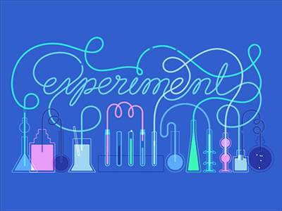
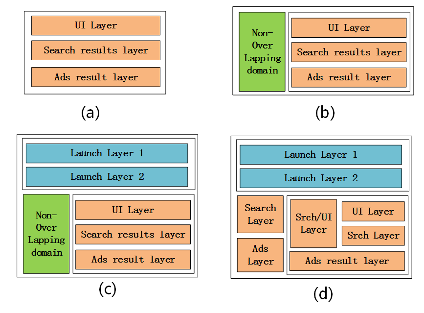
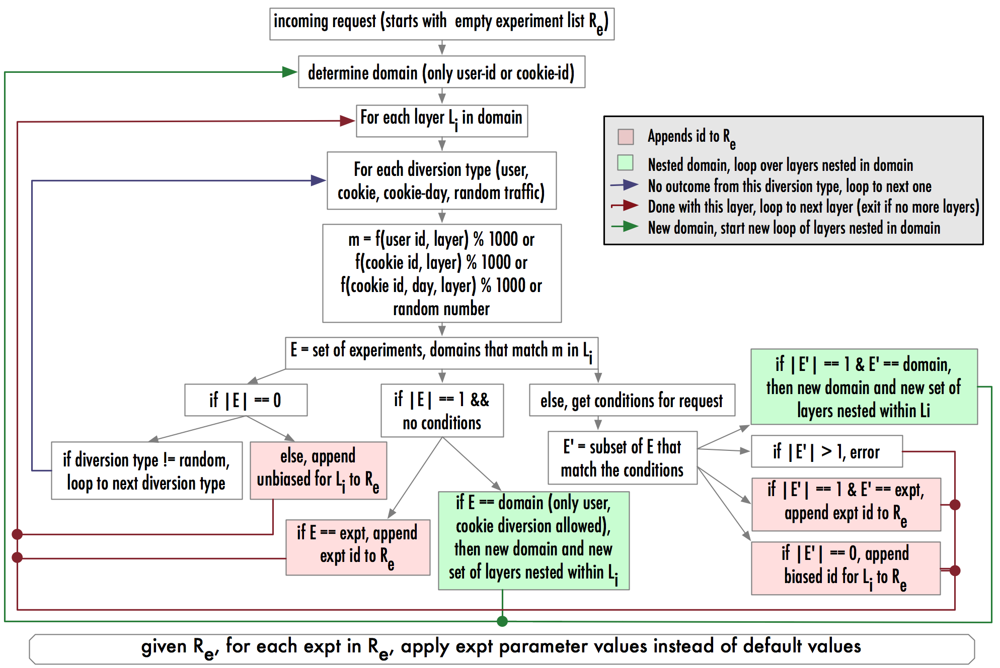
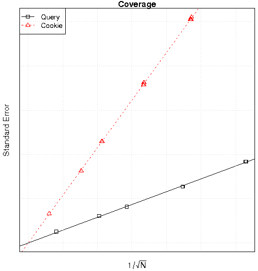
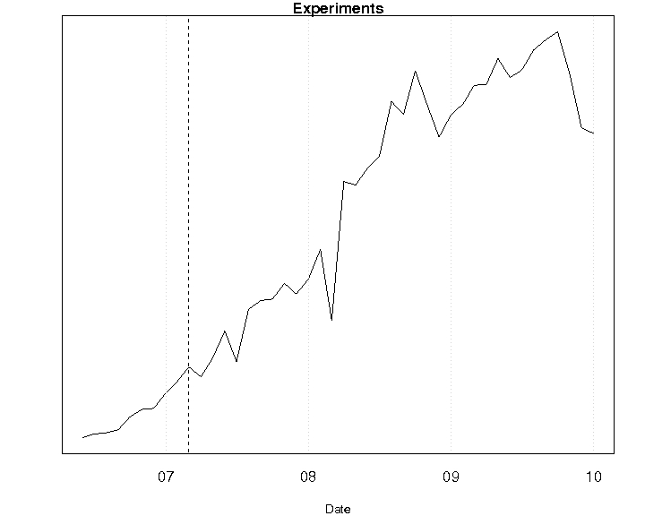
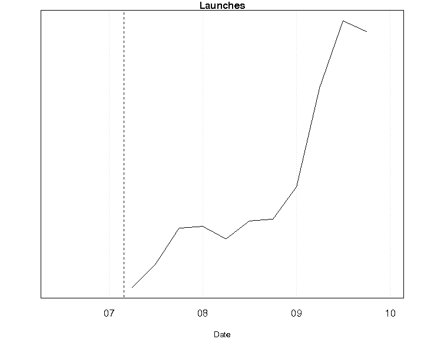

原文链接： [Overlapping Experiment Infrastructure: More, Better, Faster Experimentation](http://research.google.com/pubs/pub36500.html "Overlapping Experiment Infrastructure: More, Better, Faster Experimentation") - _Diane Tang, Ashish Agarwal, Deirdre O’Brien, Mike Meyer_，2010-07 （[本地`PDF`](overlapping-experiment-infrastructure-more-better-faster-experimentation-36500.pdf)），2010年  
基于[火光摇曳Flickering](http://www.flickering.cn/)上 _lexqu（屈伟）_ 的译文稿`v1.2.0`： [Google 重叠实验框架：更多，更好，更快地实验](http://www.flickering.cn/uncategorized/2015/01/%E9%87%8D%E5%8F%A0%E5%AE%9E%E9%AA%8C%E5%B9%B3%E5%8F%B0%EF%BC%9A%E6%9B%B4%E5%A4%9A%EF%BC%8C%E6%9B%B4%E5%A5%BD%EF%BC%8C%E6%9B%B4%E5%BF%AB%E5%9C%B0%E5%AE%9E%E9%AA%8C/)

# 重叠实验设施：更多、更好、更快地实验

<!-- START doctoc generated TOC please keep comment here to allow auto update -->
<!-- DON'T EDIT THIS SECTION, INSTEAD RE-RUN doctoc TO UPDATE -->

- [1. 序言](#1-%E5%BA%8F%E8%A8%80)
- [2. 相关工作成果【略】](#2-%E7%9B%B8%E5%85%B3%E5%B7%A5%E4%BD%9C%E6%88%90%E6%9E%9C%E7%95%A5)
- [3. 背景](#3-%E8%83%8C%E6%99%AF)
- [4. 重叠实验基础设施](#4-%E9%87%8D%E5%8F%A0%E5%AE%9E%E9%AA%8C%E5%9F%BA%E7%A1%80%E8%AE%BE%E6%96%BD)
- [5. 工具与流程](#5-%E5%B7%A5%E5%85%B7%E4%B8%8E%E6%B5%81%E7%A8%8B)
    - [5.1 工具](#51-%E5%B7%A5%E5%85%B7)
    - [5.2 实验设计与样本量](#52-%E5%AE%9E%E9%AA%8C%E8%AE%BE%E8%AE%A1%E4%B8%8E%E6%A0%B7%E6%9C%AC%E9%87%8F)
        - [5.2.1 样本量](#521-%E6%A0%B7%E6%9C%AC%E9%87%8F)
        - [5.2.2 触发、日志与反事实](#522-%E8%A7%A6%E5%8F%91%E6%97%A5%E5%BF%97%E4%B8%8E%E5%8F%8D%E4%BA%8B%E5%AE%9E)
        - [5.2.3 前期与后期](#523-%E5%89%8D%E6%9C%9F%E4%B8%8E%E5%90%8E%E6%9C%9F)
    - [5.3 快速的分析（`Fast Analytics`）](#53-%E5%BF%AB%E9%80%9F%E7%9A%84%E5%88%86%E6%9E%90fast-analytics)
    - [5.4 教导（`Education`）](#54-%E6%95%99%E5%AF%BCeducation)
        - [5.4.1 实验委员会（`Experiment council`）](#541-%E5%AE%9E%E9%AA%8C%E5%A7%94%E5%91%98%E4%BC%9Aexperiment-council)
        - [5.4.2 解读数据（`Interpreting the Data`）](#542-%E8%A7%A3%E8%AF%BB%E6%95%B0%E6%8D%AEinterpreting-the-data)
- [6. 成果](#6-%E6%88%90%E6%9E%9C)
    - [6.1 更多](#61-%E6%9B%B4%E5%A4%9A)
    - [6.2 更好](#62-%E6%9B%B4%E5%A5%BD)
    - [6.3 更快](#63-%E6%9B%B4%E5%BF%AB)
- [7. 结论与工作展望](#7-%E7%BB%93%E8%AE%BA%E4%B8%8E%E5%B7%A5%E4%BD%9C%E5%B1%95%E6%9C%9B)
- [8. 参考资料](#8-%E5%8F%82%E8%80%83%E8%B5%84%E6%96%99)

<!-- END doctoc generated TOC please keep comment here to allow auto update -->

# 1. 序言

`Google`是一个数据驱动型公司，这意味着所有对用户的改动的发布，都要决策者以相应的经验数据作为依据。这些数据大部分是由在线流量上的实验产生的。在`Web`的语境下，一个实验是由一股流量（比如，用户的请求）和在这股流量上进行的相对对比实验的修改组成的。修改包括用户可见的修改（比如，修改顶部广告的背景色），以及不可见的修改，比如测试一个新的广告点击率（`CTR`）预测算法，都可以通过实验的方式进行的。

要支持数据驱动方法论的挑战在于要跟上创新的速度。我们想支持进行尽可能多的实验，如果限制了同时进行的实验的数量，那是绝不可被接受的。我们进行实验是为了测试一些新的特性和挖掘一些已有特性的提升空间。对于已有特性，实验可以学习到用户的反应并可以对特性进行优化。试想一下，如果在搜索结果页上的内容都是通过参数控制的，包括展示方式和算法。通过对参数设置不同的参数值进行实验，我们可以用衡量指标（用户体验，收入或其它指标）来决定是否要进行哪些修改以得到最好的结果。

对`UI`的修改通常会使用实验来评价用户反应，但需要注意的是算法的修改同样也需要实验。例如：假设一些团队想测试一个新的机器学习算法来预测广告`CTR`，或是测试对现有算法的调整（比如，修改学习速度或是收敛速度）。虽然线下评估可以进行一些分析后，可以缩小参数的最佳取值区间（不是最佳取值），但最终这些参数还是需要在线上流量进行评估，分析这些参数在真实的流量上的效果（因为修改可能会影响用户的行为，并改变流量本身的模式，这是不可能在线下环境评估的）。所以，评价这些机器学习算法是需要通过线上实验的方式进行的。

设计我们实验设施的目标是：_更多_、_更好_、_更快_。

* **更多**：我们需要能同时进行多个实验的可扩展性。但是我们也需要灵活性：不同的实验需要不同的配置和不同的流量来衡量实验的统计意义上的效果显著性。有些实验只需要修改流量的一个子集，比如只是日语的流量，并需要取一个合理的流量规模。其它的实验有可能需要修改所有的流量，并对指标造成很大影响，这种才可以在小流量上进行测试。
* **更好**：不合理的实验是不应该让它在线上流量进行的。合理的但是很差的实验（比如，有`Bug`的实验或是无意中产生的很差的实验结果）都应该能很快的被捕获并且停止它的进行。标准化的标价指标可以让所有的实验进行公平的比较：比如在计算`CTR`指标的时间，两个实验应该用相同的过滤器去掉爬虫流量。
* **更快**：能够很容易并且很快地建立一个实验。容易到非工程师不需要写代码就可以创建一个实验。评价指标应该很快的被统计出来，以便分析。简单的迭代可以很快速地进行。理想状态是，实验系统不仅支持实验，并且可以控制放量，比如，以一种系统的和容易理解的方式对实验进行放量。

为了达到这些设计的目标，我们不仅需要实验设施来进行更多的实验，并且需要一些工具和指导过程来支持更多和更快的实验。

对于实验设施，有两个很明显的选择，或是要支持单层实验或是要支持多因素实验。单层实验意味着每个请求最多只会通过一个实验，单层实验是很容易使用的，并且也具有灵活性，但是扩展性不足。多因素实验在统计学上进行了大量的讨论，多因素实验中每个参数（因素）都可以被独立地实验，在实验中每个参数（因素）都可以独立地被实验，每个实验中只测试一个参数，这个参数会覆盖所有其它实验中的其它参数。每个查询可以同时在  个实验中，其中  是参数的个数。虽然这种方法进行了多年的研究和实践，但对于`Google`的系统却不适用，因为`Google`有几千个参数，并且不能被独立的分析。例如：要对两个参数进行分析，一个参数是`Web`页面的背景色，另一个是文字的颜色，虽然『蓝色』对两个参数都是合法值，但是如果两个参数都取『蓝色』，那么页面是不可读的。

本文提出的解决方案是将参数分成子集，每个参数子集包含相互不能独立修改的参数。一个参数子集会与一个包含实验的层相关联，不同层的实验的流量是正交的。每个查询（`query`）可以在  个实验中，其中  是层的数量。

# 2. 相关工作成果【略】

# 3. 背景

在讨论`Google`的实验之前，我们先描述一下我们实验设施所处的环境，因为环境给定了我们实验设施的设计所要面临的机会和限制。

宏观上看，用户通过浏览器发送`Web`页面请求与`Google`交互。请求进入`Google`的服务设施可能会落在多个二进制（`binary`）上（比如，运行在服务器上的程序），然后产生面向用户的结果页。比如，可能有一个服务决定与查询最相关的原生搜索结果，另一个服务决定与查询最相关的广告，还有一个服务将原生搜索结果和广告结果组织到结果页，返回给用户。见图1。一方面，这种模块化可以让我们降低延时（不相互依赖的过程可以并行），显然，原生的搜索过程与广告搜索过程是相互独立的，并能更快速的试验（每个服务都可以独立地进行，并且模块化的测试可以进行更快速的发布）。另一方面，如果要求每个请求最多只进入一个实验，那么模块化就需要更精心地设计。可能存在的问题有流量饥饿（上游模块的实验可能优先处理了所有请求，导致下游模块的实验没有请求）和偏置（`bias`）（比如，上游模块的实验处理了所有英语的请求，导致下游模块的实验就只有非英语请求）。

  
**图1**：一个请求经过多个模块的例子，信息（和时间）都是从左流向右

每个服务都有二进制推送和数据推送。二进制推送是指发布新的程序（`Bug`修复、性能提升、新特性，等等），它一定时期进行一次（比如每周）。数据推送更频繁（比如，按需或是每几小时推送一次），并且这还涉及了推送更新的数据到相应的程序。数据推送中还包含了默认参数配置，参数是用来配置程序如何运行，比如，控制结果如何展示的服务也许有一个参数是决定顶部广告块的背景色。再比如，预测`CTR`的服务可能有参数是控制学习速度和收敛速度的。程序可能有几百个参数。新的特性可能会添加一个或多个参数：最简单的场景是，一个参数可以控制打开或关闭新特性，在更复杂的场景中，也许有多个参数决定新特性如果展示，有数值阈值决定新的特性是否被展示，等等。将程序和数据分离，意味着如果我们可以找到合适的分离方式，我们就可以同时得到快速影响线上服务的通路，和慢速影响线上服务的通路（程序是慢的通路，改变参数值是快速的通路）。

一个`Web`搜索中的**实验**是指将一部分请求流量转向一个特定的处理路径，这个处理路径会改变向用户展示的内容。一个**对照实验**将一部分请求流量转向一个处理路径，但它并不改变向用户展示的内容。我们用数据推送来决定实验的配置。在数据推送中，有一个文件决定程序的默认参数配置。另一个文件决定实验所需要改变的参数的值，实验只用指定实验所要改变的参数，对于其它参数，都采用默认值。比如，在一个简单实验中，它只改变顶部广告的背景色这一个参数，它可以改变黄色（默认值）到粉色（实验值）。

实验还需要决定实验所用的流量如何**分配**。最简单的分配方式是用_随机流量_，即对每个请求都进行随机分配。但这样做的问题是如果实验是用户可见的改变（比如，改变背景色），那么一个用户可能就得到不同的用户体验（背景色不断地在黄色和粉色间转换），这会造成用户体验不一致。在`Web`实验中常用的方法是用 **`cookie`** 作为流量分配的依据，`cookie`被网站用来定位唯一用户。实践中，`cookie`是机器/浏览器相关的，并可能被清除。然而，虽然一个`cookie`不能唯一定位一个用户，但对于连续的查询，它可以提供给用户一致性的用户体验。对于实验流量分配，我们并不直接对每单个`cookie`进行分配，而是用 **`cookie`取模** 进行分配：用一个`ID`表示一个`cookie`，对这个`ID`模1000，将模相等的流量聚合为实验流量，比如模等于42的流量。假设`cookie`的分配是随机的，那么随意`cookie`的模数的请求数据也应该是大致相等的。在实验配置中使用`cookie`的模，也可以很容易地检查流量之间是否有冲突：实验1可能会用`cookie`模1和模2，实验2可能使用`cookie`模3和模4，这两个实验就会有相近的大小，理论上，是可以进行比较的流量。

> 【译注】：上面例子中用的示例数值42是`Hacker`必读的《银河系漫游指南》中的梗：42是万事万物的答案。

在数据文件中配置实验，可以让实验更快更方便地创建：数据文件是可读的，并容易手工编辑，不需要进行代码变更，并可以由非工程师进行创建，而且配置数据的推动会比二进制程序的发布更加频繁，它使创建仅包含已有参数的实验更加方便快捷。

在开发我们的实验设施之前，我们使用一个简单的单层实验设施，在这个设施中，每个请求最多进行一种实验。先分配`cookie`取模的流量的实验，再分配随机流量的实验。上游服务会优先分配流量，所以如果上游（即`cookie`取模的实验）进行了很多实验，那么下游可能会得不到足够的流量，即流量饥饿问题。除了这些问题之外（包括前面提到的流量饥饿和偏置问题），单层实验可以满足我们设计目标中的易用和相对的灵活性。但是在`Google`数据驱动的文件中，单层的方法没有足够的可扩展性：我们无法快速地进行足够多的实验。

# 4. 重叠实验基础设施

在本节中，我们将介绍重叠实验基础设施（`overlapping experiment infrastructure`），在尽量保留单层实验系统的优点（易用、快速）的同时，增加了可扩展性、灵活性和健壮性。我们还实现了一种可控的、定义明确的逐步放量的方式。

前面解释过，多因素实验并不适用于`Google`的实验场景，因为实验参数可能并不相互独立（比如，粉色的字和粉色的背景）。有了这个限制，我们的核心思路是将参数划分到  个子集。每个子集都关联着一个实验层，每个请求最多会被  个实验处理（每层一个实验）。每个实验只能修改自己层相关联的参数（即在参数子集中的参数），并且同一参数不能出现在多个层中。

一个很明显的问题是如何划分参数。首先，我们可以根据模块化的程序（服务）对参数进行子集划分，不同程序的参数可以划分到不同的子集中（这会解决前面提到的流量饥饿和偏置的问题）。然而一个程序所有的参数并不一定要在一个参数子集中，我们可以通过分析（比如，我们知道某些参数是相互独立的）或是通过以前实验（比如，分析以前将参数放到一起修改的实验）可以对一个程序的参数进行进一步划分。

事实上，我们设计的更加灵活，我们不止是将参数划分子集，再将子集与层相关联。为了解释灵活性，我们引入了一些定义。在流量和系统参数的语境下，我们有三个关键的概念：

* **域**是指流量的一个划分（一部分流量的意思）。
* **层**是指系统参数的一个子集。
* **实验**是指在一个流量划分上，进行零个或多个参数的修改，并最后改变请求处理的过程。

域和层可以相互嵌套。域中包含层。层中包含实验，层中也可以包含域。在一个层中嵌套域可以使这一层中的参数在嵌套域中进行进一步划分。开始时，我们有默认的域和层，它有包含所有的流量和参数，在默认域和层中，比如我们可以：

* 简单地将参数分为三层（图2a），这种情况下，每个请求最多只会同时在三个实验中，每层一个，每个实验只能修改相应层的参数。
* 我们可以先将流量分为两个域，一个域只有一个单一层（非重叠域），和一个有三个层的重叠域（见图2b），在这种情况下，每个请求会分到非重叠域或是重叠域。请求只能在非重叠域或重叠域其中之一。如果请求在重叠域，那么请求最多在一个实验中（这个实验可以改变参数集合中的任意参数的值），如果请求在重叠域，那么请求最多在三个实验中，每层一个实验。并且对于每个实验，只能使用对应层的参数。

**图2**：重叠分层示意图

这种嵌套看起来有些复杂，但它有几个好处。

1. 使用非重叠域可以让我们同时进行改变大量参数值的组合实验，这些实验参数也许并不常一起使用。
2. 它允许我们进行不同参数划分方式。比如你可以划分出三个域，一个是非重叠的，一个是有两个层的域（即对参数集合进行一次划分），第三个域进行其它的划分方式（即有不同数量的层）。
3. 嵌套可以更有效地利用空间，可以根据常用的参数划分方式，和哪些跨层的实验经常进行，注意将一个层的参数从一个层移到另一个层是很容易的，只要确认参数可以安全地与原有层的参数值重叠，并注意保证不同层的实验会被独立地进行，对于基于`cookie`取模的实验，我们用`mod = f(cookie, layer) % 1000`，而不是`f(cookie) % 1000`的方式，虽然这种方式增加了复杂性，但它也增加了灵活性。对配置的修改是需要付出代价的，特别是对域的修改，修改域的流量，即是修改实验的流量，比如如果我们将非重叠流量大小从10%修改到15%，这多出来的5%流量来自重叠域，以前经过重叠域的请求现在会经过非重叠域。

另一个概念是**发布层**（`Launch layers`），发布层与前面介绍的实验层有下面区别：

* 发布层总是在默认域中（比如，它们有全部流量）。
* 发布层是对参数的一个独立划分，比如，一个参数最多只能同时在一个发布层和最多一个正常层中（一个域中）。
* 为了让发布层和正常层的重复参数配合起来。在发布层中的实验有着稍有不同的语法。特别是，在发布层的实验会为覆盖参数的默认值，作为新的默认值，换言之，如果没有正常实验层的实验覆盖了默认参数，那么在发布层的行为就像一个普通的实验，但如果实验层的实验覆盖了默认值，那么实验就会用这个覆盖的值，而不是系统的默认值，或是发布层实验中的参数值。

发布层的示例在图2c、2d中，通过发布层，我们能以一种标准通用的方式逐步灰度最终全量一个实验策略，且可以跟踪灰度过程中实验效果变化。 通常情况下，每有一个新特性要开始全量时都需要新建一个发布层，当这个新特性最终完成全量时，再将相应的发布层删除。并且因为发布层实验的流量一般都比较大，所以它们可以用于测试特性之间的相互影响，虽然理论上我们可以测试正常实验层的特性相互影响（比如，如果参数在同一层，我们可以手工设置创建实验，如果参数在不同层，我们观察实验的交集流量），但因为在正常层中，实验流量比较少，交集比较小，所以相互影响很难检测。

从前面我们已经了解到实验和域都是在操作一份流量，（我们称这种流量为『分配』的流量），为了更有效的进行实验流量分配，我们提出了两个不同的概念：分配类型和分配条件。

我们在第三节讨论了两种**流量分配类型**，即`cookie`取模方式和随机方式，还讨论了为了让层与层之间实现流量之间相互独立，在`cookie`取模时加入了层`id`的信息（`mod = f(cookie, layer) % 1000`）。我们还支持另两种流量分配类型，用户`id`取模和`cookie`日期取模，用户`id`取模类似于`cookie`取模，区别仅是对用户`id`取模而不是`cookie`，对于`cookie`日期取模，综合`cookie`和日期的信息后再取模，采用这种方式的话，一个实验一天内圈定的`cookie`是固定的，但随着日期的变更会圈定不同的`cookie`。在所有的场景中，是没有办法配置一个实验能使特定的`cookie`或是用户必通过这个实验。同样，在分析实验结果的时候也要考虑不同抽样方式的差别。同样注意，我们当前只支持的四种分类型，但我们也可以支持其它的流量分配类型，比如通过`Hash`查询串分流。

支持多种流量分配类型的主要目的一方面是为了保持处理的一致性，另外也希望可以覆盖到所有可能的情况，比如因时间变化而表征出来的不同特征。基于这些原因，我们以特定的顺序对不同的流量分配类型进行分流：用户`id`，`cookie`，`cookie`日期，随机。一旦这个请求被某高优先级分配方式抽中后，其它低优先级的分配方式将忽略这个请求（图3），虽然这个顺序最大化地了一致性，但它也有一个缺点，比如，在同一层中1%的`cookie`取模流量会比1%的随机流量大，在极端情况下，我们会遇到流量饥饿问题。在实践中，一层之中一般只应有一种分流类型，实验和对比实验必须使用相同的分流类型，最主要的影响是不同的分流类型实验需要不同的样本量（见5.2.1节）。

在通过流量分配类型选择一部分流量后，**分流条件**（`condition`）通过仅分配特定条件的流量给实验或域，以达到更高效利用流量的目的。比如，一个实验仅仅改变来自日语的查询，那么实验配置中只抽取日语的流量。我们可以基于地区，语言，浏览器等信息设置流量抽样条件。有了分流条件，一个只使用『日语』流量的实验，和一个只使用英语流量的实验，可以使用相同的`cookie`取模。另一个使用分流条件的场景是灰度测试新代码（代码是通过二进制推送发布的），比如，在一股小流量上测试新代码，以保证新代码没有`Bug`，并与预测一致，然后才能放到大流量环境中（灰度环境中，通过错误日志和实验监控方式检查`Bug`）。为了支持这种使用场景，我们提供了以机器或数据中心为分流条件的分配方式，它进一步限制了一个实验的流量。虽然灰度实验无法代替严格的测试，但它们是一个有用的补充，因为它既限制了潜在的错误，并且它让新的代码在真实环境中运行，从而可以遇到各种在测试环境中很难构造的真实请求。

  
**图3**：决定请求进入域、层、实验的逻辑

分配条件是直接在实验（或域）的配置中指定的，这允许我们在实验的创建时基于数据文件对流量分配冲突进行检测。如在流量分配类型一节中提到的一样，如果一个请求先满足了流量分类顺序中的一个_类型_，它不会再考虑下面的分配类型，即使它不满足这一种分配类型的分配条件。这很重要，最好以一个例子来说明，如果我们通过特定的`cookie`取模来得到实验的流量，我们将会得到一个无偏的分配。考虑一下一个指定`cookie`取模上有两个实验，一个分配条件为日语流量，另一个分配条件是英语流量，而这个`cookie`取模剩余的流量（即不是日语和英语的流量）将不会分配给以`cookie`分配方式的其它实验，这是为了避免分配顺序后几种分配方式的**偏置**，重要的逻辑是不再将上述剩余的流量分配给分配顺序后几种分配方式的实验了。我们通过将有偏的剩余流量分配一个偏置`id`来避免偏置。

图3中展示了一个请求分配给域，层和实验的逻辑。这些逻辑都以动态库的方式实现，编译链接到二进制之中，所以任何修改（比如，新的分配类型，新的分配条件，等等）都会在日常的二进制推送时集成到系统中去，动态库保证了在整个系统内的一致性，并且从动态库中自动可以获取到最新的功能。

在这个设施下，一个特性的评估和发布过程是类似如下过程的：

* 在合适的模块中，实现新的特性（包括`code review`、二进制推送、设置默认参数等等，和标准的工程实践一样）。
* 创建一个灰度实验（通过数据推送方式），以保证特性可以正常工作，如果不能正常工作，那么可能就要重写代码修复这个问题。
* 创建一个实验或是一组实验（通过数据推送的方式）来评估特性。注意配置实验涉及指定分配类型和相关的分配参数（比如：`cookie`取模），分配条件，和特性相关的参数。
* 评估实验指标。根据实验结果，判断是否要进行新一轮的实验，即通过修改或创建新的实验，或甚至修改代码从根本上改变特性。
* 如果特性可以发布，就进入发布过程：创建一个新的发布层和发布层实验，逐步的放量这个实验，并最终删除发布完的发布层，然后将发布层实验的相关参数设为系统默认参数。

# 5. 工具与流程

虽然重叠实验设施是有能力运行更多的实验，更快速地进行实验，并能同步优化实验效果，但只依靠设施还是不够的。我们还需要工具、研究、和教导过程来支持更快速的实验。在本节，我们讨论几个关键的工具和过程，以及它们如何帮助我们扩展的。

## 5.1 工具

* **数据文件检查：** 数据文件的其一优势是它们可以被自动检查错误，这可以避免一些不合理的实验运行。我们会自动检查法语错误（所有的必填字段都有并且合法），一致性和约束错误（比如，`id`的唯一性，根据所有的参数判断是否实验在正确的层，是否这一层有足够的流量来支持实验，流量约束检查，如果实验要求的流量已经被另一个实验使用了，等等，注意当可用的分配条件集合变大时，这些检查就变的复杂了），和基本的实验设置检查（是否实验有对比实验，并且对比实验在相同的层，是否对比实验与实验的流量分配方式和规模一致，等等）。
* **实时监控：** 我们用实时监控来检测基本的指标（比如`CTR`），我们通过实时监控尽快地发现某个实验是不正常的，实验者可以设置监控指标的期望值区间（也有这些指标的默认波动区间），如果监控指标超出了期望的波动区间，那么会触发自动告警，然后实验者可以修改期望区间或停止他们的实验，或调整它们的实验参数值，但它允许实验者可以激进地对于可能的潜在的变化进行测试，因为错误或预期之外的影响会被很快检测到。

## 5.2 实验设计与样本量

相比基本的对实验配置的基本检查外（比如，每个实验都必须有一个对照实验，它与实验使用相同的分流条件），实验设计（`experiment design`）和样本量（`sizing`）是更高级的话题。

### 5.2.1 样本量

如 _Kohavi_ 论文[7]中所述，样本量应该让实验有足够的统计意义，可以统计认为有意义的指标很小的变化。在本节中，我们讨论以及实验样本量，以及实验依赖的设置，还有一些相关的样本量的工具。

一个实验的有效规模定义为：

在工程实践中，我们主要关注  和  ，但要通过  个和才能影响相关的实验指标，为了正确确定  值，我们需要知道：

* 实验所关注的指标是什么。
* 对每个指标，我们想检测实验改变的敏感度（）值是什么。比如，实验者想检测到2%的点击率变化。
* 对每个指标，一个抽样单元（）样本标准误差是（），实验大小为  的标准误差为 。

_Kohavi_ 假设实验与对照实验有相同的大小，比如  ，那么必须  大于等于  才能满足最小变化检测需求，16这个值是由置信度（  ，通常为95%）和期望的统计功效（  ，通常为80%）决定的。

我们这套重叠做法的一个优点是我们可以在每一层创建一个大的比照实验，这样它可以被多个实验共享，如果共享的对照实验规模比实验大的多（  ），那么我们可以用  而不是  ，这样虽然样本量变小为  ，却有着90%的统计功效（  ）。

在确定实验规模的过程中，更重要的问题是如何估计标准误差  ，特别是当我们使用很多比率指标  时（比如，覆盖率，有多少查询是返回广告的（有广告返回的查询/全部查询量））。问题产生于是实验的单元与分析的单元不一致时，比如，对于覆盖率，分析的单元是一个查询，但对于`cookie`取模的实验而言，实验的单元是一个`cookie`（一系列查询），并且我们无法假设来来自同一用户或`cookie`的请求之间是相互独立的，我们的方法是计算  ，即每个实验的标准误差，然后以  来表示  ，在上例中，  是每个`cookie`取模的标准误差，且  。对于比率指标，我们用`delta`方法计算    [11]。

图4是在不同实验中，包括`cookie`取模和随机流量实验，对于覆盖率指标与标准误差呈  的关系，图中的斜线即是  ，坐标轴上的值出于保密的原因隐去了，但可以看出`cookie`取模的斜线比查询的斜线陡峭，比如在相同的准确度下衡量相同的覆盖率的变化，一个`cookie`取模的实验需要比随机流量实验大的规模。

**图4**：在分配类型下计算覆盖度  的斜线

因为不同的指标和不同的分配有着不同的  ，那么我不应该让每个实验者自己去计算它， 我们提供了一个工具计算实验者指定的关注指标和指标敏感度，分配类型（比如`cookie`取模或是随机流量）和他们想要的某种流量（比如，分配条件，比如日语流量），工具就告诉实验者他需要多大规模流量才可以支持他的要求的实验。实验者可以轻松地在流量大小和敏感量之间权衡，有了这个工具，我们可以认为实验者在运行实验之前会设置合理的实验规模。

为了为我们的实验规模工具收集数据，我们一直运行一组 **同质测试**（`uniformity trial`），比如，我们运行许多 对比实验或A vs. A实验。这些实验有着不同的实验规模和分配类型，我们可以用这些结果经验地衡量我们指标的自然变化（`natural variance`），并可以测试我们计算的置信区间的正确性。

### 5.2.2 触发、日志与反事实

回顾一下，流量分配是指分配给实验的流量，但是一个实验可能不会对所有分配给它的流量进行新特性服务，相反，一些实验可能仅在某种请求时被 **触发器**（`trigger`），比如一个实验是测试何时应该显示天气信息，它可能会得到全部的流量 ，但只有一部分流量的查询会触发显示天气，这一部分但触发查询就称为触发集合。

通常，我们无法仅将触发集合的流量给实验，因为要确定请求是否触发，是需要运行时计算的，这种运行时的计算正是触发无法实现成分配条件的原因（这个触发条件很难构造对照实验流量），所以，重要的工作是记录事实（`factual`，当实验被触发）和反事实（`counter-factual`，当实验可被触发），反事实是在对比实验中记录的，比如在前面的例子中，事实（当天气信息展示）是记录在实验中的，反事实是记录在对照实验中的。比如当这个查询是可以展示天气信息的（因为它是在对比实验中，所以实际并没展示）。这些日志对于实验样本量和分析实验都很重要，因为流量中包括了没有实验变化的请求，这些请求会稀释实验的作用，在触发集合上衡量实验结果会更准确衡量实验的影响。另外，通过关注于触发集合的显著效果，实验流量的需求可以减少，因为实验的有效规模是依赖于我们要想检测的敏感度的倒数（）。

### 5.2.3 前期与后期

一个前期（`pre-period`）是指在先于开始实验的时期，这时期与实验有着相同的流量（比如，相同的`cookie`取模），但没有实验的效果，一个后期（`post-period`）是类似的概念，区别是它是在实验之后的，这两个时期类似于一个对比实验与另一个对比实验比较，只是使用实验的流量，前期是保证一个实验与它的对比实验是实际可比的，而不受其它因素影响，比如，有未捕获的垃圾流量或是爬虫，后期判断运行实验是有学习到的效果，这些技术仅能用于用户`id`和`cookie`取模实验。

## 5.3 快速的分析（`Fast Analytics`）

虽然前面提到的设施，可以同时进行许多实验，并快速地运行一个实验，但没有实验分析工具，一个真正的实验进程是无法在本质上快速进行的。对实验工具完整的讨论已经超出了本文的范围，但这里我们讨论一个重要的设计目的。

分析工具最重要的目标是提供实验者要衡量它们的实验的指标。在`Google`，我们并不将好多个实验指标合成一个目标函数，而是查看多个指标，以更彻底地理解用户的体验是如何改进的（比如，用户可以多快解析这个页面，点击按钮应如何移动，等等），注意，实时流量只能衡量发生了什么，而无法看到改变的原因。

实验除了正确性和完备性，对一个实验分析工具的其它重要设计目标包括：

* 正确地计算和显示置信区间：实验者需要知道是否他的实验仅是没有得到足够的流量（置信区间太宽），或是是否观察到的变化是统计显著的。我们研究了很多种计算准确置信区间的方法，虽然无法完整地讨论已经超出了本文范围，仅说明一下我们考虑了`delta`方法和其它的经验方法来计算置信区间：将实验分成几个子集，从这些子集上统计方差，并注意，一定要观察多个实验指标和实验，因为一些指标值会随机显示为显著，所以一定要多检查。
* 一个好的`UI`，`UI`必须是易用的，并是易于理解的。图形化是会有所帮助的，如果要聚合的效果在一定时期内是致的，即使是简单的走势图也能对可视化有所帮助。`UI`也应提示不合理的比较（比如，比较两个不同层的实验），并且`UI`应该方便地更改对比的实验，或对比的时期等等。
* 支持划分，聚合后的数值常会有误导性，比如导致指标改变的原因也许并不是实验（比如，`CTR`改变），而是因为一个混合的变化（比如，更多的商业搜索词）。正如 _Kohavi_ 所言[4]，辛普森悖论的观察与理解是很重要的。
* 扩展性，它必须能方便地添加用户自定义的指标和划分，特别是对新特性，已经存在的指标集合和划分可能是不够的。

只有一个工具提供实验准确的指标意味着我们有唯一的一致性实现，它使用相同的过滤器（比如，移除潜在的爬虫流量和垃圾流量），这样，不同的团队之间就可的`CTR`值就具有了可比较性。一个唯一的工具也更高效，因为计算会一次完成后，并呈现给实验者们，而不是每个实验者进行他们自己的计算。

## 5.4 教导（`Education`）

现在我们有了重叠设实验施和相关工具，实验设计已经完成了进行更多、更快、更好的技术方面的要求。我们还是要讨论一下人的因素。教导在促进健壮的实验目标中是同样重要的。在`Google`，有两个过程来保证实验是良好设计的，并且一个实验的结果是能被理解和传播的。

### 5.4.1 实验委员会（`Experiment council`）

第一个过程我们称之为实验委员会，它包含一组工程师，他们会审核实验者在做实验前提交的一个轻量级的`checklist`，`checklist`中问题包括：

* 基本的实验特性（比如，实验测试什么？它们的假设是什么？）
* 实验的建立（比如，要修改哪些参数，每个实验或实验集合分别要测试的是什么？在哪一层？）
* 实验的流量分配和触发条件（比如，使用什么分配类型和什么分配条件，在多大比例的流量触发实验）
* 实验分析（比如，关注哪个指标？实验者要检测的指标敏感度是什么？）
* 实验规模和时间跨度（即保证，给定一定的流量，实验是有足够的统计量来检测指标敏感度）
* 实验设计（比如，是否要用预时期和后时期来保证，是否反事实日志正确被记录等等）

初次使用的实验者会通过这些问题学习合理的实验设计和实验样本量，并了解实施一个实验背后的技术细节。有经验的实验者仍会发现`checklist`仍是有用的。不止于此，这个方法可以将所产生的更好的实验实践传播出来（比如，产生了新的工具来促进实验，产生了新的评价指标，等等），这个`checklist`是一个`Web`应用，`Web`应用对于存档和教导都是有用的，教导作用体现在实验者可以阅读以往的`checklist`来理解相关信息。

### 5.4.2 解读数据（`Interpreting the Data`）

另一个过程是讨论会，实验者们带着他们的实验结果与专家进行讨论，讨论的目标是：

* 保证实验的结果是有效的。在有些时候，即使有实验委员会，但在实际的实验上出错了，或是有一些意外发生，在这些情况中，讨论会中的讨论就像是一个调试（`debugging`）的过程，而对涉及的应用、日志、实验设施、指标和分析工具都有整体了解的专家是解决问题的关键。
* 有了有效的结果后，要保证对指标集合做整体的观察，以理解实验结果到底如何，其它划分数据的方法或是改变指标也许可以更进一步理解实验的影响。一些实验很复杂，需要实验者追踪地进行几次。
* 有了完整的结果集合，讨论并决定整个实验是一个正影响或负影响的用户体验，有了决定后，决策者可用这个数据（结合策略和战略信息）来决定是否要发布这个实验，或提出可能的改进建议，或是放弃。

讨论会对实验者是一个学习如何解读实验结果的有益之所，有经验的实验者通常不会犯以前犯过的错误，并可以预期要得到完全理解的实验结果，需要什么数据。讨论是开放的，将来要进行实验的人，可以参加以了解运行一个实验需要了解什么。实验都会记录，我们就有了一个知识库。

# 6. 成果

我们在2007年3月部署了我们的重叠实验设施（以有很多工具和处理前期和后期的设施发布），最终衡量我们整个系统成功的指标是我们在运行更多的实验，更好地运行，更快得到结果的能力。

## 6.1 更多

我们可以用几个标准来判断我们是否成功地运行更多的实验，在一个时期上一共运行了多少实验，这些实验中有多少发布了，有多少不同的实验在运行实验（见图5）。要说明的是实验的数目包含了对照实验的数目。对于运行实验人数，一些实验是有多个拥有者的（比如，如果某人离开城市或发生了事），或是将团队邮件列表中的成员也认为拥有者。不幸的是，我们无法轻松地知道有多少拥有者是非工程师，但有意思的是，非工程师的数据是在增加的，对分布层的数量，我们只计算了使用重叠实验的发布层的数量。在重叠实验之前，我们用其他的一些机制发布实验，但它们的频率在下降。在所有的图中，`Y`轴上的数据出于保密的原因隐去了（它们是线性比例），但从趋势上可以明显地看出，我们系统支持了指数级增加的实验，发布，实验者。

  
**图5**：实验，拥有者，发布数量在时间上的趋势图

## 6.2 更好

另一个衡量我们整体系统工具和系统的指标是判断是否比以前运行实验更好，于此我们仅有耳闻，没有实际的数据，但我们是实验委员会和讨论组的成员，我们见过这个系统发布前后的许多实验情况，我们观察的结论是：

* 错误配置的实验变少了，尽管我们仍偶尔会遇到日志的问题（反事实）或是诡异的错误/失败情况。
* 被遗忘的实验变少了（比如，有进行了实验，却之后忘记了分析实验）。
* 『究竟你是用什么指标衡量`CTR`的』或是『你用的是什么过滤器』的讨论减少了，有一个权威的分析工具，讨论的重点现在仅在于对指标进行解释，而不是确保指标的定义和计算都是合理的。
* 更好的合理性检查，比如有预时期来确保实验所用的流量是没有问题的。

显然理想的结果是上述问题都不存在，但是考虑到我们有更多的实验者，而上述问题即在下降，这已经是一个不错的结果。

## 6.3 更快

最后的一个衡量我们系统成功的指标是我们是否最终更快地得到数据，并更快地做出决策，对于速度，我们还是没有具体数据，但我们可以讨论对实验速度的观察，实验可以分解为下面几个阶段：

* 实现一个新特性并对它进行测试，这阶段现在是最慢的，所以我们还建立了其它工具（不在本文范围）来加速创建和测试原型（比如，将下面两个步骤分离：建立可实验的版本和正式可发布版）
* 对这个实现的特性创建一个新的实验，这个阶段要花几分钟或几小时来创建，取决于参数的复杂性，和一个少的可以忽略的提交前的检查时间（几秒到几分钟），创建时的`review`时间同样很短，数据推送的时间取决于二进制，时间在1-2小时（包括灰度测试时间）到半天。
* 运行实验的速度取决于实验的规模和实验要运行多久才能得到想要的统计显著值。我们在实验开始后的数小时就通常就可以对实验的效果有大致的了解。实验总的时间跨度取决于：实验所需要的迭代次数、规模和紧急性，等等。
* 分析实验的时间长短也不一定。在很多情况下，不需要自定义的分析方法，或是只需要对分析工具进行很小的扩展。在这些情况中，分析速度通常很快（数天）。但在其它情况下，需要自定义的分析方法分析的时间的长度就不一定了。

概括才言，当前的耗时点有：实现一个实验，在预时期的运行时间、自定义分析。这些耗时点是我们努力解决的点。

# 7. 结论与工作展望

在本文中，我们描述了重叠实验设施、相关工具和教导过程来以进行更多实验，更好且更健壮的实验和更快的实验。我们并给出了实践中我们的工作的结果：更多实验、更多实验者、更多发布，并更快速且更少的错误。虽然实际的实现是针对`Google`，但关于设计的讨论对于任何想收集统计数据评估变化的公司都是适用的。

下面是几个我们要继续改进我们实设设施的方向，包括：

* 提供加速实验新特性的方法和推动一些特别的实验（不是通过参数表达的实验）。
* 突破一个实验参数被限制到一个层的规定。特别是，对于数值参数，我们添加了运算操作（比如，乘、加），它们是可传递的，也就是可组合的。有了这些操作符，我们可以在多个层用同一参数，只要实验都只是指定对默认值的操作，而不是覆盖默认值。
* 有的时候我们需要在很小的流量切片上运行实验，比如小语种上（比如乌兹别克语、斯瓦希里语）。在这样的小的流量切片上进行实验，通常很难在一个合理的时间范围内有足够大的规模得到统计意义上显著的结果。
* 继续提供更多新的分配条件（和相关的验证以保证健壮性）以支持更有效地利用实验空间，等等。

> 【译注】：斯瓦希里语是当今非洲最常用的语言之一。

我们将继续对实验进行创新，因为实验越来越多，用数据驱动的决定越来越多。

**感谢**：很多参与了本文的工作，并没有以作者的身份出现。下面下一个不完全的参与者名单：Eric Bauer、Ilia Mirkin、Jim Morrison、Susan Shannon、Daryl Pregibon、Diane Lambert、Patrick Riley、Bill Heavlin、Nick Chamandy、Wael Salloum、Jeremy Shute、David Agraz、Simon Favreau-Lessard、Amir Najmi、Everett Wetchler、Martin Reichelt、Jay Crim、and Eric Flatt。Robin Jeffries、Rehan Khan、Ramakrishnan Srikant、Roberto Bayardo，他们对本文提出宝贵意见。

# 8. 参考资料

* [1] D. Agarwal, A. Broder, D. Chakrabarti, D. Diklic, V. Josifovski, and M. Sayyadian. Estimating rates of rare events at multiple resolutions. In **_Proceedings of the ACM Conference on Knowledge Discovery and Data Mining (KDD)_**, 2007.
* [2] W. G. Cochran. **_Sampling Techniques_**. Wiley, 1977.
* [3] D. Cox and N. Reid. The theory of the design of experiments, 2000.
* [4] T. Crook, B. Frasca, R. Kohavi, and R. Longbotham. Seven pitfalls to avoid when running controlled experiments on the web. Microsoft white paper, March 2008\. http://exp-platform.com/Documents/ExPpitfalls.pdf.
* [5] Google. Google website optimizer. http://www.google.com/analytics/siteopt.
* [6] T. Joachims. Optimizing search engines using clickthrough data. In **_Proceedings of the ACM Conference on Knowledge Discovery and Data Mining (KDD)_**, 2002.
* [7] R. Kohavi, R. Longbotham, D. Sommerfield, and R. M. Henne. Controlled experiments on the web: Survey and practical guide. **_Data Mining and Knowledge Discovery_**, 18, no. 1:140–181, July 2008.
* [8] M. Krieger. Wrap up & experimentation: Cs147l lecture, 12 2009. http://hci.stanford.edu/courses/cs147/lab/slides/08-experimentation.pdf .
* [9] Microsoft. Microsoft’s experimentation platform. http://exp-platform.com/default.aspx.
* [10] M. Richardson, E. Dominowska, and R. Ragno. Predicting clicks: Estimating the click-through rate for new ads. In **_Proceedings of the 16th International World Wide Web Conference_**, 2007.
* [11] L. Wasserman. All of Statistics: **_A Concise Course in Statistical Inference_**. Springer Texts, 2004.
