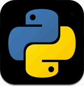

`Python` Philosophy原文及相关说明： [http://www.c2.com/cgi/wiki?PythonPhilosophy](http://www.c2.com/cgi/wiki?PythonPhilosophy)    
译文发在：[`Python` Philosophy（`Python`哲学）翻译及简析](http://oldratlee.com/147/tech/python/python-philosophy.html)，2010-09-28

# `Python` Philosophy（`Python`哲学）翻译及简析

<!-- START doctoc generated TOC please keep comment here to allow auto update -->
<!-- DON'T EDIT THIS SECTION, INSTEAD RE-RUN doctoc TO UPDATE -->

- [`Python`哲学](#python%E5%93%B2%E5%AD%A6)
    - [译注](#%E8%AF%91%E6%B3%A8)
- [个人讨论](#%E4%B8%AA%E4%BA%BA%E8%AE%A8%E8%AE%BA)
- [参考/阅读资料](#%E5%8F%82%E8%80%83%E9%98%85%E8%AF%BB%E8%B5%84%E6%96%99)
- [`Python` Philosophy原文](#python-philosophy原文)

<!-- END doctoc generated TOC please keep comment here to allow auto update -->

# `Python`哲学

**Python之禅** —— Tim Peters

1. 美优于丑。
1. 直白优于隐晦。
1. 简单优于复杂。 **_[1]_**
1. 复杂优于纠结。 **_[2]_**
1. 扁平优于嵌套。 **_[3]_**
1. 稀疏优于稠密。 **_[4]_**
1. 可读性是有重要价值的。
1. 特例可以有，但不能特例到打破规则。
    - 尽管在纯粹性和实用性之间倾向的是实用性。
1. 出错决不能无声无息地忽略。
    - 除非明确地说明了是无声无息的。
1. 面对二义性情况时，要拒绝任何猜的诱惑。
1. 一件事应该一种做法 —— 并且宁愿只有一种做法 —— 一种显而易见的做法。
    - 尽管在刚开始的时候这个做法可能不是那么显而易见，毕竟你不是荷兰人。 **_[5]_**
1.  『现在』优于『决不』。 **_[6]_**
    - 尽管『决不』常常优于『**_马上_**』。 **_[7]_**
1. 如果一个实现难于解释清楚，那它是个差的想法。
1. 如果一个实现很容易解释清楚，那它可能是个好的想法。
1. 命名空间是个拍案叫绝的想法 — 放手多多用起来吧！

## 译注

**_[1] [2]_** 单词 complex 的意思是 复杂，而 complicated 是 结构复杂。

在计算机领域中，complex 可以对应 单个模块复杂，而 complicated 则可以对应 多个模块互相关联的复杂。
用计算机的术语来说，complicated 是不同模块之间紧『耦合』，体现了理解不深，设计不好。

软件的核心复杂度不可避免，但要这些集中一起，给用户一个干净高级的接口，
也就是说：如果 **complex**（核心复杂度）不可避免可以接受，
但 **complicated** 一定要想办法去除，随着系统深入理解，模块职责的划分会更简明干净。  
PS： 核心复杂度的说明讨论可以参见[《代码大全》](http://book.douban.com/subject/1477390/)一书。

翻译上，complex 翻成 复杂，complicated 翻成 纠结。

**_[3]_** 这里的『扁平』和『嵌套』说的是代码逻辑，嵌套的逻辑增加了逻辑及其对应理解的复杂性，应该想办法用更好的设计来避免深的逻辑嵌套实现。

另外，一个对应的话题是『数据』的 『扁平』 vs.『嵌套』，个人看来，期望用『嵌套』的数据，因为这可以简化数据理解规则和处理逻辑。可以把『嵌套』的数据看成是有『Namespace』的，也呼应了最后一条大力推荐使用命名空间。

更多讨论参见：

- [Zen Masters: "Namespaces are a honking good thing" vs "Flat is better than nested". What gives? - reddit.com](https://www.reddit.com/r/Python/comments/xzvxi/zen_masters_namespaces_are_a_honking_good_thing/)
- [“Flat is better than nested” - for data as well as code? - stackoverflow.com](http://stackoverflow.com/questions/4372229/flat-is-better-than-nested-for-data-as-well-as-code)
- [The author makes the assertion that flat is better than nested, and indeed it's one of the rules in "import this", but I just don't see it. | Hacker News](https://news.ycombinator.com/item?id=627858)

**_[4]_** 稀疏、稠密指的是代码行中操作的疏密。
`C`的`Geek`，喜欢写稠密的代码，比如使用`++`，`--`运算符来压缩代码行。
在`Python`看来，这个做法不可取，即会让代码更可能出错（如自增操作的副作用），也降低了代码的可读性。

**_[5]_** 这里的荷兰人指`Python`之父[_Guido_](https://zh.wikipedia.org/wiki/%E5%90%89%E5%A4%9A%C2%B7%E8%8C%83%E7%BD%97%E8%8B%8F%E5%A7%86)，参见说明：[武汉大学开源技术俱乐部 技术交流 第1期](http://qianjigui.iteye.com/blog/266365)。

在这里作者[_TimPeters_](http://www.c2.com/cgi/wiki?TimPeters)即含蓄地表达了对`Python`之父[_Guido_](https://zh.wikipedia.org/wiki/%E5%90%89%E5%A4%9A%C2%B7%E8%8C%83%E7%BD%97%E8%8B%8F%E5%A7%86)的敬意，又体现了自己作为`Python`开发的傲娇，不是吗？ :grin:

**_[6] [7]_** 关于『Now/现在』、『never/决不』、『right now/马上』，个人理解，这个条目要说的是：

决定是否做实现一个功能，要想清楚，要么做要么不做，都能给出 **_明确的_** 理由；但不要模模糊糊的说『后面马上』做，回避对系统的分析思考。

否则结果会是：

- 『马上』做 是 『世界上最不能相信』的话 :smile: ，想想饭店服务员的话『您要的菜马上就好』，其实你自己知道后面往往就不会去做这个功能了。  
    更多『世界上最不能相信』的话参见[世界上最不能相信的几句话](http://blog.renren.com/share/339618932/7590788371)。
- 『马上』做 === 不经过思考的不做，结果系统没有做一个本该这个系统做的功能！然后这个功能在不合适的地方被实现，即系统设计有问题。

# 个人讨论

既有指明大是大非的理念，又有指导细节操作的准则。

既有谆谆教导的推荐，也有声色俱厉的禁止。

每一个点都千锤百炼；每一点都有直指内心的感觉。

看了N遍，每遍都会深思。

`Python`说得内容对生活个人觉得一样有指导性，果然是哲学。

# 参考/阅读资料

1. [Python(programming language) - Wikipedia](http://en.wikipedia.org/wiki/Python_%28programming_language%29#Programming_philosophy)
1. [No programming language offers what Python does philosophically.](http://www.indicthreads.com/1062/no-programming-language-offers-what-python-does-philosophically/)  
在编程哲学上，`Python`超越了其它编程语言。
1. [武汉大学开源技术俱乐部 技术交流 第1期](http://qianjigui.iteye.com/blog/266365)。  
这里还有其它有关`Python`有意思的东西。
1. 核心复杂度的说明参见[《代码大全》](http://book.douban.com/subject/1477390/)一书。
1. [世界上最不能相信的几句话](http://blog.renren.com/share/339618932/7590788371)

#  `Python` Philosophy原文

**The Zen of Python**, by Tim Peters

1. Beautiful is better than ugly.
1. Explicit is better than implicit.
1. Simple is better than complex.
1. Complex is better than complicated.
1. Flat is better than nested.
1. Sparse is better than dense.
1. Readability counts.
1. Special cases aren't special enough to break the rules.
    - Although practicality beats purity.
1. Errors should never pass silently.
    - Unless explicitly silenced.
1. In the face of ambiguity, refuse the temptation to guess.
1. There should be one -- and preferably only one -- obvious way to do it.
    - Although that way may not be obvious at first unless you're Dutch.
1. Now is better than never.
    - Although never is often better than **_right_** now.
1. If the implementation is hard to explain, it's a bad idea.
1. If the implementation is easy to explain, it may be a good idea.
1. Namespaces are one honking great idea -- let's do more of those!

