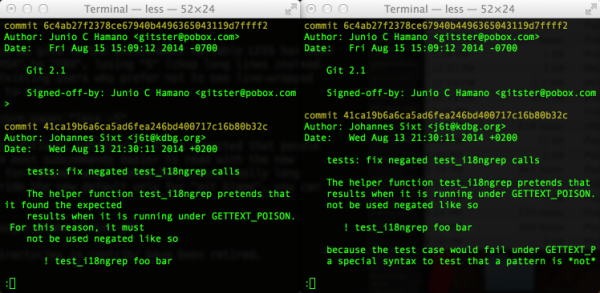

原文链接： [What’s new in Git 2.1](http://blogs.atlassian.com/2014/08/whats-new-git-2-1/) - [Tim Pettersen](http://blogs.atlassian.com/author/tpettersen/)，2014-08-25   
译文发在[博乐在线](http://www.jobbole.com/)： [http://blog.jobbole.com/76550/](http://blog.jobbole.com/76550/)，2014-09-08

`Git` `2.1`有哪些新特性？
======================


在`git` `2.0.0`发布2个半月后，作为小版本更新迎来了`2.1.0`，带来了一大波令人兴奋的新特性。

完整的发布说明文档可以在[这里](https://raw.githubusercontent.com/git/git/master/Documentation/RelNotes/2.1.0.txt)查看，但如果你不怎么接触`git`社区，会觉得发布说明文档有些太简明了。这篇文章是我对这次发布在`Atlassian`使用中令我们兴奋的方面所做的评注。

更好的分页程序缺省设置
------------------

本文引文都是直接摘自发布说明文档，其中会加上自己的评注。

> 从很早期的`Git`开始，调用`less`分页程序用的`LESS`环境变量设置的缺省值是`FRSX`。`S`选项（截断长文本行而不是折行）从缺省值中删除了，因为对不同的人有不同的说法，这个选项或多或少是个人口味问题。相比，其它的选项作为缺省设置是合理的（如，`R`选项非常合理，因为很多不同的输出都是彩色的，而`FX`也是合理的，因为输出常常短于一页。）

如果你还没有覆盖过`git`分页程序的缺省值，这个变化意味着`git`命令的分页输出会在终端宽度的地方折行而不是截断行。下面是`git` `2.1.0`（折行，左图）和`git` `2.0.3`（截断，右图）显示的例子：



这个只会影响你日志的输出，如果你用的是一个窄的终端，或者在提交消息中有长行。一般`git`推荐提交日志信息的[宽度不要超过72字符](http://stackoverflow.com/questions/2290016/git-commit-messages-50-72-formatting)，但如果觉得折行很烦，可以通过恢复原来的行为来禁用：

```bash
$ git config core.pager "less -S"
```

当然，分页程序也会用于其它的输出，比如`git blame`，这种情况下由于作者名的长度和代码风格，可以能会有很长的行。`2.1.0`的发布说明文档也指出了可以只在`blame`的分页程序中启用`-S`选项：

```bash
$ git config pager.blame "less -S"
```

如果你对`git`还在使用的缺省`less`选项很好奇，说明如下：

- `-F`：让`less`进程自动退出，如果输出少于一页。
- `-R`：保证只有`ANSI`颜色转义序列按原始形式输出，这样`git`控制台颜色才能生效。
- `-X`：避免屏幕在`less`启动时被清空。这个也是在`less`输出少于一页时才有用。

更好的`Bash`补全
------------------

> 更新了`Bash`的补全脚本（在`contrib/`目录），能更好地处理定义了复杂命令序列的别名。

这个**超酷**！我是一个自定义`git`别名的大粉丝。能够在复杂的别名上用上`git`的`Bash`自动补全，让这些别名在命令行上使用起来更强大和方便。举个例子，我定义一个可以从日志中`grep`出`JIRA`风格的`issue`主键（如`STASH-123`）的别名：

```bash
issues = !sh -c 'git log --oneline $@ | egrep -o [A-Z]+-[0-9]+ | sort | uniq' -
```

所有的命令行参数传给`git log`命令，这样可以限制提交的范围用于返回`issue`主键。比如，`git issues -n 1`只会显示我的分支最近一次提交所关联的`issue`主键。在`2.1.0`中，`git`的`Bash`补全让我可以像`git log`命令一样去补全`git`的`issue`别名。

在`git` `2.0.3`下，键入`git issues m<tab>`会退化成缺省的`Bash`补全行为，列出当前目录下`m`开头的文件。在`git` `2.1.0`下，正确地补全成`master`，就和`git log`命令下补全动作一样。通过在别名加上空命令前缀`:`，可以用于提示`Bash`补全行为。如果要补全的不是别名中的第一个命令，这个很有用。举个例子：

```bash
issues = "!f() { echo 'Printing issue keys'; git log --oneline $@ | egrep -o [A-Z]+-[0-9]+ | sort | uniq; }; f"
```

这个别名不能正常补全，因为`git`不能把`echo`命令识别为补全目标。但如果加上前缀成`: git log;`，补全就正确了：

```bash
issues = "!f() { : git log ; echo 'Printing issue keys'; git log --oneline $@ | egrep -o [A-Z]+-[0-9]+ | sort | uniq; }; f"
```

如果你喜欢编写复杂的别名脚本，这是个可用性的巨大改进！请记住，补全功能的脚本在`contrib/`目录下，不是`git`核心的一部分，所以如果你要使用这个功能，不要忘了更新`Bash profile`指向新版本的`contrib/completion/git-completion.bash`。

`git commit`命令使用`approxidate`
------------------

> `git commit ‐‐date=<date>`选项有了更多的时间戳格式选项，包括`--date=now`。

当严格的`parse_date()`函数不能解析给的日期字符串时，`git`提交的`--date`选项现在会回退到`git`酷炫的（也有些古怪的）`approxidate`（大概日期）解析器。`approxidate`可以处理显而易见的值，像`--date=now`，也允许一些略复杂格式，像`--date="midnight the 12th of october, anno domini 1979"`或是`--date=teatime`。如果你想了解更多，Alex Peattie有一篇优秀的[关于`git`酷炫日期处理的博文](http://alexpeattie.com/blog/working-with-dates-in-git/)。

更好的路径显示方式`grep.fullname`
------------------

> `git grep`会读取`grep.fullname`配置变量，强制`‐‐full-name`成为缺省。这可能会让以脚本方式使用的用户出错，这些用户不期望这样的新行为。

省得你去翻`git-grep`的`man`，下面是`--full-name`选项的文档说明：

> `--full-name`
>
> 当从子目录运行时，命令输出的路径通常相对于当前目录。这个选项强制输出的路径是相对项目的顶级目录。

非常贴心！这个缺省行为非常符合我的工作方式，我常常会运行`git grep`找出一个文件的路径，拷贝粘贴到一个`XML`文件中（这样的做法可能出卖了我是个`Java`开发 :grin:）。如果你也觉得有用，只要简单运行： 

```bash
$ git config --global grep.fullname true
```

在你的配置文件开启这个选项。

`--global`选项把配置应用到`$HOME/.gitconfig`文件中，这样配置值就会成为我系统上所有`git`仓库的缺省行为。如果有必要，你可以也只在仓库级别覆盖配置值。

更聪明的`git replace`
------------------

停一会儿！先看看`git replace`能做什么？

简单地说，`git replace`重写`git`仓库中的某个对象并且不保持对应树或是提交的`SHA`不变。如果你是第一次听到`git replace`并且知道`git`的数据模型，会觉得这样的做法听起来很逆天！我就是这么觉得。我有另一篇正在写的博文讨论什么时候和为什么要使用这样的功能。如果现在你想了解更多，看[这篇文章](http://git-scm.com/blog/2010/03/17/replace.html)比看`man`手册好得多，手册中只有很少且有些牵强的用例说明。

> `git replace`会读取`--edit`选项，可以编辑一个已有的对象再做替换。

`--edit`选项会`dump`一个对象的内容到一个临时文件，启动你喜欢的编辑器，这样就可以方便地拷贝和替换这个对象。要替换`master`分支的最近那次提交，可以简单运行命令：

```bash
$ git replace --edit master
```

或者编辑最近那次提交的`blob`，假设是文件`jira-components/pom.xml`，可以运行命令：

```bash
$ git replace --edit master:jira-components/pom.xml
```

应该这么做？基本上不会 😄 大部分情况应该用`git rebase`重写对象，这样会正确的重写提交的`SHA`，保证历史是健全的（`sane history`）。 

> `git replace`会读取`--graft`选项，可以编辑父提交。

`--graft`选项是替换一个提交有相同的内容但用不同的父提交的快捷操作。这可以方便地完成一个稍微正常一点的`git replace`的用例，[缩短`git`历史](http://git-scm.com/blog/2010/03/17/replace.html)。要替换`master`分支的最近那次提交的父，可以简单运行命令：

```bash
$ git replace master --graft [new parent]..
```

或者要砍掉某个点之后的历史，可以忽略所有父提交让这个提交成为孤儿提交：

```bash
$ git replace master --graft
```

再次说明，如果没有好的理由基本上不应该这么做。通常重写历史的首选方法是用明智的`git rebase`。

更合理的`tag`排序通过`tag.sort`
------------------

> `git tag`开始注意`tag.sort`的配置问题了，这个配置在没有指定`--sort`选项时做为缺省排序。

如果你在`tag`名中使用版本号（我想99.9%你就是这么做的），这真是好消息。一旦你发布的版本号中有一段多于一个数字（比如 `v10`或`v1.10`），`git`缺省的字典排序就不好用了。举个例子，看看`Atlassian Stash`的`git`仓库的缺省`tag`排序：

```bash
src/stash $ git tag -l *.*.0
..
stash-parent-2.0.0
stash-parent-2.1.0
stash-parent-2.10.0
stash-parent-2.11.0
stash-parent-2.12.0
stash-parent-2.2.0
stash-parent-2.3.0
stash-parent-2.4.0
stash-parent-2.5.0
stash-parent-2.6.0
stash-parent-2.7.0
stash-parent-2.8.0
stash-parent-2.9.0
stash-parent-3.0.0
..
```

有问题啊！`2.10.0`是`2.3.0`之后发的，所以缺省的`tag`排序不对的。从`git` `2.0.0`开始，可以用`--sort`选项可以正确按数值做版本排序：

```bash
src/stash $ git tag --sort="version:refname" -l *.*.0
..
stash-parent-2.0.0
stash-parent-2.1.0
stash-parent-2.2.0
stash-parent-2.3.0
stash-parent-2.4.0
stash-parent-2.5.0
stash-parent-2.6.0
stash-parent-2.7.0
stash-parent-2.8.0
stash-parent-2.9.0
stash-parent-2.10.0
stash-parent-2.11.0
stash-parent-2.12.0
stash-parent-3.0.0
..
```

这好多了。在`git` `2.1.0`中，可以设定这种排序成缺省方式，运行命令：

```bash
$ git config --global tag.sort version:refname
```

顺便说一下，上面的示例`git tag`命令中使用了方便的`-l`选项，限制了只显示符合指定模式的`tag`名。`-l *.*.0`用于只显示大版本（`major`）和小版本（`minor`）的`Stash`的发布。

更简单地验证有签名的提交
------------------

> 新加了`git verify-commit`命令用于检查有签名提交的`GPG`签名，使用方式和`git verify-tag`检查签名的`tag`类似。

如果你要用提交签名来认证提交的作者，`verify-commit`命令大大简化了验证签名的操作。不再需要自己写个脚本去分析`git log --show-signature`，只要简单把要验证签名的那些提交传给`git verify-commit`。有可能你没有用签名提交（在`Atlassian`我们没有用），因为这么做需要管理`Key`和开发额外麻烦的操作。对于多数项目，一般情况下签名的`Tag`是在方便性和安全性之间一个更好的平衡。如果你想知道为什么有项目要使用签名提交，Mike Gerwitz讲了一个在假设场景下[`git`的恐怖故事](http://mikegerwitz.com/papers/git-horror-story)，这个场景下签名提交是非常有用的。所以如果你在特别敏感的企业工作，可能要把它加入到工作流中。

更多的性能加速
------------------

`git` `2.1.0`也带来了一些不错的性能提升。

> 引入了使用2个文件（一个基础文件和一个相应的增量文件）来表示索引的试验性格式；当要重写只有小部分工作树变化的大索引时，这样可能减少I/O消耗。

复述一下意思就是：如果你的提交有大量文件修改时，运行`git add`可能会更快。我本地的任何增量操作，`git add`已经像闪电一样快了，所以我看不出和测试的`git`版本之间有什么大的性能变化。有意思的是，大量文件的第一次`add`好像快了一点。做了个快糙猛的性能测试，我试着暂存所有在`JIRA`代码库从`JIRA 5`到`JIRA 6`的修改。

```bash
$ git checkout jira-v6.0
$ git reset jira-v5.0
$ time git add --all
```

`git` `2.0.3`平均使用2.44秒。而`git` `2.1.0`平均使用2.18秒 —— 节省超过10%的时间！注意，由于实验条件这是个很不准确的测试，添加14500+个文件到索引中节省了1/4秒，所以在日常`git`使用中不会看到大的变化。关于新索引格式可以在[索引格式文档](https://code.google.com/p/git-core/source/browse/Documentation/technical/index-format.txt)中了解更多。

> 缺省开启了`core.preloadindex`配置项，以充分利用现代平台的多核。

不错！之前我没有开启这个功能，但升级到`2.1.0`后性能变化很显著。再做一个快糙猛的测试，运行`git status`显示之前我用的从`JIRA 5`到`JIRA 6`的暂存修改。显示暂存的14500+个文件，`git` `2.0.3`平均使用4.94秒。而`git` `2.1.0`平均使用3.99秒 —— 节省了多达～19%的时间。如果你使用了自定义的`shell`提示符，在每次提示符显示时检查工作拷贝中是否有未提交的修改，这个性能就非常有用！当索引很大时，我明显觉得`bash`反应快了一些。

> 通过重组用于跟踪已有提交的数据结构，大大优化了`git blame`。

在分析出谁提交某行（搞坏项目的）代码，`git blame`更快了。我很高兴看到这个改进，就是说`git-guilt`（我写的一个小工具，用于研究[如何`blame`提交的修改](https://blogs.atlassian.com/2014/07/git-guilt-blame-code-review/)）可以有相当的性能提高，因为它重度依赖于`blame`到函数的输出。

又来一个快糙猛的测试，看一下算出`git`源码仓库从`2.0.0`到`2.1.0`的『罪行证据』（`guilt transfer`）要花多长时间。这个操作`git-guilt`要在`git` `2.0.0`到`2.1.0`修改过的不同大小的文件上调用886次`git blame`命令。

```bash
$ git guilt v2.0.0 v2.1.0
```

`git` `2.0.3`平均使用72.1秒。而`git` `2.1.0`平均使用66.7秒，提升了7.5%！如果有兴趣，你可以看看[`git-guilt transfer`](http://pastie.org/9492426)的实际代码（Karsten Blees的66 LOC行的实现，以微弱优势胜出Junio C Hamano）。

上面的性能测试都有些随意，但我们正在进行`Bitbucket`的`git` `2.1.0`升级。线上会监控升级前后的功能，可以确定新版本对这些操作的性能影响，特别是`blame`和`diff`操作。过几周我会发出结果让大家知道。

等等，还有还有！
------------------

在`git` `2.1.0`中还有其它很好的内容我没有在一篇文章中涉及到，所以有兴趣可以看看[完整的发布说明文档](https://raw.githubusercontent.com/git/git/master/Documentation/RelNotes/2.1.0.txt)。由衷地感谢`git`团队又提供了一个高质量和丰富新功能的版本。如果你有兴趣了解更多有关于`git`的实用小建议和花边新闻，欢迎在Twitter上关注我（[@kannonboy](https://twitter.com/kannonboy)）和Atlassian开发工具（[@atldevtools](https://twitter.com/atldevtools)）。
