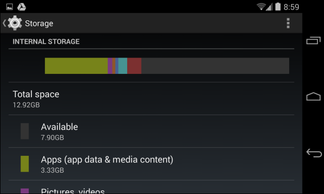
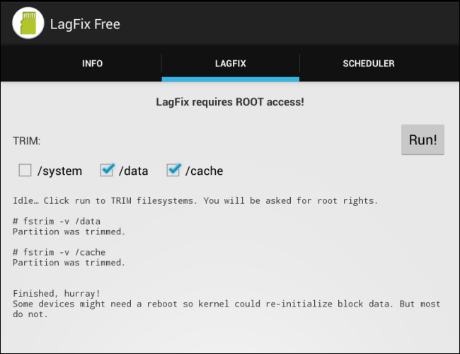

原文链接： [Chris Hoffman](http://www.howtogeek.com/183004/why-android-phones-slow-down-over-time-and-how-to-speed-them-up/)     
译文发在[极客范](http://www.geekfan.net/)： [http://www.geekfan.net/7350/](http://www.geekfan.net/7350/)，2014-03-09

<!-- START doctoc generated TOC please keep comment here to allow auto update -->
<!-- DON'T EDIT THIS SECTION, INSTEAD RE-RUN doctoc TO UPDATE -->

- [为什么`Android`手机会越用越慢，如何提速？](#%E4%B8%BA%E4%BB%80%E4%B9%88android%E6%89%8B%E6%9C%BA%E4%BC%9A%E8%B6%8A%E7%94%A8%E8%B6%8A%E6%85%A2%EF%BC%8C%E5%A6%82%E4%BD%95%E6%8F%90%E9%80%9F%EF%BC%9F)
  - [`OS`更新和大型应用](#os%E6%9B%B4%E6%96%B0%E5%92%8C%E5%A4%A7%E5%9E%8B%E5%BA%94%E7%94%A8)
  - [后台进程](#%E5%90%8E%E5%8F%B0%E8%BF%9B%E7%A8%8B)
  - [存储空间快满了](#%E5%AD%98%E5%82%A8%E7%A9%BA%E9%97%B4%E5%BF%AB%E6%BB%A1%E4%BA%86)
  - [没有启用固态硬盘的`TRIM`](#%E6%B2%A1%E6%9C%89%E5%90%AF%E7%94%A8%E5%9B%BA%E6%80%81%E7%A1%AC%E7%9B%98%E7%9A%84trim)
  - [总结](#%E6%80%BB%E7%BB%93)

<!-- END doctoc generated TOC please keep comment here to allow auto update -->

为什么`Android`手机会越用越慢，如何提速？
====================================

安卓手机和平板越用越慢？貌似挺多人会这么觉得。好吧，一起来看看设备变慢的原因和如何提速。

当然这不是只是安卓才有的问题——可以用用`iOS7`的`iPad3`，看看会变得有多慢——但貌似确实很多安卓用户会反映这个问题。

`OS`更新和大型应用
--------------------

比起一年前，你的手机上的应用几乎全部换了。如果有[安卓系统更新](http://www.howtogeek.com/129273/why-your-android-phone-isnt-getting-operating-system-updates-and-what-you-can-do-about-it/)，要么更新可能并没有针对你的设备很好的优化，其结果就是你的设备变慢了；要么运营商或制造商在更新中[捆绑更多的软件](http://www.howtogeek.com/163558/how-carriers-and-manufacturers-make-your-android-phones-software-worse/)，这些软件在后台运行并拖慢了设备。

即使你没有更新系统，比起一年前设备会安装更新的应用，无论新应用还是一个应用的新版本，应用几乎总是越来越重。因为应用开发者会接触到更快的智能机硬件，游戏和其它应用会针对这些更快设备来优化，结果在老设备上性能越来越差。这个现象在各个平台都一样。年复一年，网站变得更重，桌面应用要吃更多内存，游戏要更好的硬件来运行。

**解决方法：** 这个问题作为用户没有太多可以做的。如果系统变慢了，你可以装个[定制的`ROM`比如`CyanogenMod`](http://www.howtogeek.com/162516/how-to-flash-your-nexus-s-or-any-other-android-device-with-a-new-rom/)，定制`ROM`没有捆绑软件和制造商的皮肤（很多设备都有）。如果应用变慢了，可以去找找更轻的应用。

后台进程
--------------------

设备用的过程中会安装越来越多的应用，有些应用是开机启动并后台运行，消耗`CPU`并占用内存。后台应用多了设备就慢了。安卓支持真正的多任务，所以应用可以后台运行。

如果在主屏使用动态壁纸或是放了很多小部件，会消耗`CPU`、显卡和内存。清理主屏就能提升设备速度。

后台运行的应用会消耗资源，检查后台进程可以查看设置（`Settings`）应用，切换到【正在运行】（`Running`）一栏。看到不使用的应用在后台运行，卸载掉这个应用。如果应用是设备自带的应用不能卸载，就[禁用](http://www.howtogeek.com/120599/6-things-you-dont-have-to-root-android-to-do-anymore/)掉。不要只是点停止服务，应用还是会自动启动的。

**解决方法：** 禁用动态壁纸，删除小部件；卸载或是禁用不用的应用（或许你想卸载所有你没用过的应用）。

存储空间快满了
--------------------

[固态硬盘没有剩余空间会变慢](http://www.howtogeek.com/165542/why-solid-state-drives-slow-down-as-you-fill-them-up/)，所以在文件快满的情况下写操作会很慢，结果是应用运行很慢。在设置应用的存储界面可以查看设备存储的使用量以及是什么消耗了存储空间。

如果不定期检查，缓存文件会占用很大一部分空间，清理缓存文件可以释放出磁盘空间，让文件系统性能更好。打开设置应用，点开存储界面，往下滚动，点击缓存数据，再点确定，可以一次性清理所有应用的缓存文件。

**解决方法：** 卸载不用的应用，删除无用的数据，清理应用缓存[释放存储空间](http://www.howtogeek.com/112356/5-ways-to-free-up-space-on-android/)。也可以重置到出厂设置、只装要用的应用，这样变回一个『新』设备了。

没有启用固态硬盘的`TRIM`
--------------------

缺乏合适的`TRIM`支持是导致[`Google`原版的`Nexus` 7平板越用越慢](http://www.howtogeek.com/164106/why-is-my-nexus-7-so-slow-8-ways-to-speed-it-up-again/)的主要原因。在安卓`4.3`加上了合适的`TRIM`支持，`Nexus`设备上更新到安卓`4.3`都可以解决这个问题。

如果你的老设备不支持安卓`4.3`，可以`ROOT`设备后安装[`LagFix`](https://play.google.com/store/apps/details?id=com.grilledmonkey.lagfix&amp;hl=en)应用来添加`TRIM`支持。这个应用在后台运行和安卓`4.3`一样的`fstrim`命令。由于固态硬盘运行方式，[固态硬盘会越用越慢](http://www.howtogeek.com/165542/why-solid-state-drives-slow-down-as-you-fill-them-up/)，`TRIM`是必须的。固态硬盘越用越慢是因为闪存单元在再次写入前需要先清除。`TRIM`可以预先清除删除了的文件所在闪存单元中的数据，这样保证安卓写入数据到闪存单元时可以尽快完成。

**解决方法：** 如果你的是老设备，`ROOT`并安装`LagFix`应用。在安卓`4.3`及以后版本这个已经自动做好了。

总结
--------------------

重置设备到出厂设置、只安装要用的应用，可以一票删除所有老应用和文件。重置到出厂设置虽然不能解决捆绑应用和在存储上运行`TRIM`，但有助如于解决越用越慢的问题，你懂得，就像[重装`Windows`](http://www.howtogeek.com/133254/beginner-geek-how-to-reinstall-windows-on-your-computer/)有助解决`PC`越用越慢。
